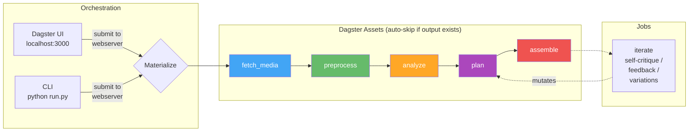

# vlog

Automated vlog generation from Synology Photos. Downloads trip photos/videos, plans a narrative with AI (Gemini or Claude), generates background music with MusicGen, and renders a highlight reel. Three planning modes: **visual** (Gemini sees actual photos — fastest), **api** (Claude plans from text descriptions), **algo** (deterministic scoring). Orchestrated by [Dagster](https://dagster.io) with a web UI.

## Architecture



## Quick Start

```bash
# One command: creates venvs, installs deps, walks you through config, starts services
python start.py

# Visual planner (fastest — Gemini sees photos directly, no local vision model)
python run.py -n singapore full -f 2025-06-13 -t 2025-06-17 \
  --trip-type family --planner visual --duration 180

# API planner (Claude plans from local vision model descriptions)
python run.py -n singapore full -f 2025-06-13 -t 2025-06-17 \
  --trip-type family --planner api --duration 180

# Quick test (low res, fast)
python run.py -n sg-test full -f 2025-06-13 -t 2025-06-16 \
  --planner visual --duration 60 --item-types photo \
  --width 640 --height 360 --fps 15

# Stop all services
python start.py stop
```

On first run, `start.py` will:
1. Create Python venvs and install all dependencies
2. Check for FFmpeg and Ollama (with install instructions if missing)
3. Walk you through `.env` configuration (NAS credentials, API keys)
4. Pull required Ollama models (llava:7b, llama3:8b)
5. Start Ollama, Synology Photos API, and Dagster

Subsequent runs skip setup and just start services. Run `python start.py setup` to re-run setup.

## Workspace Structure

```
workspace/
  media/                          <- shared: raw photos/videos (downloaded once)
  analysis_cache/                 <- shared: per-file vision results ({item_id}.json)
  keyframes/                      <- shared: extracted video keyframes
  music/                          <- shared: generated music tracks (cached)
  runs/
    singapore/                    <- per-run: isolated pipeline outputs
      manifest.json
      preprocessed.json
      analysis.json
      edl_v1.json, edl_v2.json   <- versioned EDLs
      clips/
      output/vlog_v1.mp4, ...    <- versioned outputs
    singapore-cinematic/          <- another run, same source data
      ...
```

Media files, analysis results, and music tracks are shared across runs. A second run for the same trip reuses all downloads, vision results, and music — only plan + assemble re-run.

## Usage

### CLI

All CLI commands submit to the Dagster webserver — runs appear in the UI.

```bash
# Full pipeline (visual planner — recommended)
python run.py -n singapore full -f 2025-06-13 -t 2025-06-17 \
  --trip-type family --planner visual --duration 180 --music auto

# Resume from where you stopped (auto-skips completed stages)
python run.py -n singapore resume

# Re-plan with different style (cascades to re-assemble)
python run.py -n singapore plan --trip-type adventure --style cinematic --duration 120

# Re-assemble only
python run.py -n singapore assemble

# Self-critique loop
python run.py -n singapore iterate --rounds 2

# Human feedback
python run.py -n singapore iterate --feedback "more family shots at the beach"

# Style variations
python run.py -n singapore variations
```

### Key flags

| Flag | Values | Description |
|------|--------|-------------|
| `--trip-type` | family, solo, food, adventure, architecture, general | Scoring profile and narrative style |
| `--planner` | visual, api, algo | Gemini visual (recommended), Gemini text-only, or algorithmic |
| `--force-analyze` | flag | Force re-run vision analysis (ignore cached analysis.json) |
| `--music` | auto, /path/to/file | Generate via MusicGen or use custom file |
| `--style` | upbeat, cinematic, reflective, energetic | Pacing and transitions |
| `--duration` | seconds | Target vlog length |
| `--item-types` | photo, video, live, motion | Media types to include |

### Web UI (Dagster)

After `./start.sh`, open **http://localhost:3000**.

**Run the full pipeline:** Jobs → full_pipeline → Launchpad → paste config.

**Resume:** Materialize All with defaults — auto-skips stages with existing outputs.

**Monitor progress:** Run event log shows per-item status for every stage, with ETA for analyze and assemble.

## Pipeline Stages

### 1. fetch_media
Downloads photos/videos from Synology Photos API, filtered by date range, location, person IDs, and item types.

### 2. preprocess
Assigns tiers based on family member presence (from Synology face detection), clusters near-duplicates using time proximity + HSV histogram similarity, and builds a day/time_block/location timeline.

| Tier | Criteria | Role |
|------|----------|------|
| A | 2+ family members | Emotional core |
| B | 1 family member | Supporting |
| C | 0 people + has location | B-roll / scenery |
| D | Screenshots, no location | Skipped |

### 3. analyze
Two modes depending on planner:

- **Visual mode** (`--planner visual`): Generates thumbnails for photos and keyframes for videos (single FFmpeg pass per video). No local vision model — Gemini sees the actual images in the plan stage. Fast (~1-2min for 300 items). All results cached.
- **Local mode** (`--planner api/algo`): Vision analysis via Ollama (llava:13b). Tier A/B items get a family-tuned prompt, Tier C gets a scene prompt. Slow (~2hrs for 300 items). Results cached per-file.

### 4. plan
Three backends:

- **Visual planner (recommended)**: Gemini sees actual photos via contact sheets + video filmstrips. 3-pass planning: (1) narrative arc design with Gemini Pro, (2) visual selection with Gemini Flash, (3) review with Gemini Pro. Skips local vision model entirely. Outputs EDL with `music_mood` per segment and `narrative_rationale`. Supports video trim points (`start_time`/`end_time`).
- **API planner**: 3-pass Claude Sonnet planning from text descriptions. Requires local vision model to have run first. Extended thinking available.
- **Algo planner**: Deterministic selection using scoring profiles per trip_type, with hero shot identification, content-aware Ken Burns effects, time-proximity dedup, and portrait penalty.

All planners produce an EDL (Edit Decision List) with segments, transitions, and text overlays. Video items can include trim points for scene selection.

### 5. assemble
Renders each item as a video clip (Ken Burns effects for photos, trimmed clips for videos with `start_time`/`end_time`), adds text overlays, concatenates with crossfade/fade_black transitions, renders intro/outro title cards. Generates background music via MusicGen if `--music auto` — uses `music_mood` from the EDL segments as the generation prompt. After rendering, auto-reviews the output with Gemini: extracts frames, sends for critique, re-plans and re-renders if improvements found.

## Trip Types & Scoring

Each trip type has a different scoring profile that affects photo selection:

| Trip Type | Tier A/B/C bonus | Togetherness | Emotion | Quality | Scene bonus |
|-----------|-----------------|-------------|---------|---------|-------------|
| family | 20/10/0 | x2.0 | x1.5 | x1.0 | — |
| solo | 5/5/10 | x0.0 | x1.0 | x2.0 | landmark+5, nature+5 |
| food | 5/5/10 | x0.5 | x1.0 | x1.5 | food+10, meal+10 |
| adventure | 10/8/8 | x0.5 | x2.0 | x1.5 | activity+8, nature+5 |
| architecture | 3/3/15 | x0.0 | x0.5 | x2.5 | landmark+8, building+8 |
| general | 10/7/5 | x1.0 | x1.0 | x1.5 | landmark+3, nature+3, meal+3 |

## Music Generation

When `--music auto` is passed, the assemble step generates background music using Meta's MusicGen (facebook/musicgen-medium, 1.5B params) running locally. The prompt is derived from trip_type + style. Generated tracks are cached in `workspace/music/` — subsequent runs reuse them instantly.

Music generation takes ~20 minutes for 60s of audio on an M-series Mac. The track is mixed into the final video with fade-in/fade-out.

## Requirements

- **Python 3.11+** with venv
- **FFmpeg** — video processing
- **Ollama** — local vision model (only for `--planner api/algo`, not needed for visual mode)
  - `ollama pull llava:13b` — vision analysis
- **Synology Photos API** — the [synology-photos-project](../synology-photos-project) backend running on `:8000`
- **Dagster** — workflow orchestration (installed via `pip install -e .`)
- **Gemini API key** — for all planners and iterate/feedback (`GEMINI_API_KEY` in `.env`)

Optional (installed with `pip install -e ".[all]"`):
- **openai-whisper** — speech-to-text for video transcription
- **pillow-heif** — HEIC/HEIF photo support (cross-platform)
- **PyTorch + transformers + scipy** — MusicGen background music generation

All services start with `python start.py` (Ollama, Synology API, Dagster).

### Platform Notes

| Feature | macOS | Windows | Linux |
|---------|-------|---------|-------|
| HEIC photos | Built-in (sips) | `pip install pillow-heif` | `pip install pillow-heif` |
| Whisper | mlx-whisper (Apple Silicon) | openai-whisper | openai-whisper |
| MusicGen | Works | Works | Works |
| FFmpeg | `brew install ffmpeg` | [ffmpeg.org/download](https://ffmpeg.org/download.html) | `apt install ffmpeg` |
| Ollama | `brew install ollama` | [ollama.com/download](https://ollama.com/download) | `curl -fsSL https://ollama.com/install.sh \| sh` |

### 24GB MacBook resource usage

| Component | Model | RAM |
|-----------|-------|-----|
| Vision | llava:13b | ~8GB |
| Planning | Gemini API (remote) | — |
| Music | MusicGen medium | ~6GB |
| Whisper | mlx-whisper medium | ~1.5GB |

Only one Ollama model loaded at a time. Dagster uses `concurrency_key` to prevent contention.

## Testing

```bash
source venv/bin/activate
python -m pytest tests/ -v                    # all 119 tests (~1s)
python -m pytest tests/ -m integration -v     # integration tests only (requires FFmpeg)
python -m pytest tests/ -m "not integration"  # unit/mocked tests only
```

## Key design decisions

- **Dagster asset model** — each stage is a Dagster asset that produces a file. Auto-skips when output exists. Re-materialize from the UI to force re-run + downstream cascade.
- **Trip-type generalization** — scoring profiles, narrative prompts, and music prompts all adapt to trip type. The same pipeline handles family trips, solo adventures, food tours, etc.
- **Gemini API for planning** — the visual planner uses Gemini 3 Flash to see actual photos via contact sheets, producing better narrative than text-only planning. The API planner also uses Gemini Flash for text-based planning from local vision model descriptions. Both use 3-pass planning: arc design → shot selection → self-review.
- **Music in assemble, not plan** — music generation happens during rendering, using the actual video duration. Plan just declares intent (`music_mode=auto`).
- **Shared media + analysis cache** — raw files and per-file vision results are shared across runs. Only plan + assemble re-run.
- **Per-run isolation** — each run gets its own directory for manifest, EDL, clips, and output.
- **Interruptible everything** — all subprocess calls use `Popen` with signal forwarding. All Ollama calls use streaming.
- **EDL is the central artifact** — a JSON file that flows between plan/assemble/iterate. Changing the edit never re-analyzes media.
- **Content-aware rendering** — hero shots get longer duration and slow zoom-in. Landscapes get horizontal pan. High-quality scenery gets static display. Portraits get blurred background overlay.
- **HEIC conversion** — Apple HEIC photos are converted via pillow-heif (cross-platform), macOS sips, or ImageMagick, whichever is available.
