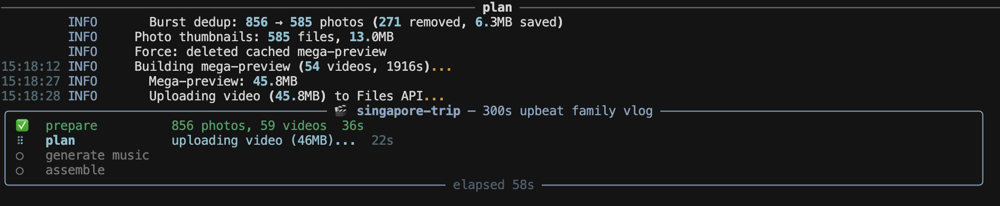

# reelsmith

[](https://github.com/Guoyuer/reelsmith/actions/workflows/ci.yml)
[](https://www.python.org/downloads/)
[](LICENSE)

**Turn a folder of photos and videos into a polished highlight reel — with one command.**

AI plans the edit, FFmpeg renders locally at full resolution. Your raw media never
leaves your machine — only compressed thumbnails and preview clips are sent to Gemini
for planning. Rendering happens entirely on your GPU at 4K60 if you want.
Planning cost depends on candidate count, preview length, and model preset:
`fast` is lowest cost, `balanced` is the stable default, and `quality` uses Pro.




## Features

- **AI plans, local renders** — Gemini only sees 400px thumbnails and 480p 1 fps preview
  clips. Your original 4K photos and videos stay local. FFmpeg renders
  the final output from source files at any resolution you choose.
- **Sees and hears everything** — despite the compression, Gemini sees every photo
  and watches every video clip with audio. It selects by visual and aural judgment,
  not metadata.
- **Per-segment AI music** — Lyria RealTime generates mood-matched background tracks,
  crossfaded into one composite. Dynamic ducking around speech via `sidechaincompress`.
- **Beat-synced transitions** — cuts snap to music beats via BPM detection.
  Speech segments are preserved without snapping.
- **GPU-accelerated** — NVENC (Linux/Windows) and VideoToolbox (macOS) for encoding
  and decoding. Automatic fallback to CPU.
- **Rich terminal UI** — live progress panel with per-stage status, sub-stage bars,
  cost tracking, and a summary table on completion.
- **Iterate fast** — thumbnails and previews are cached. Re-planning is a single Gemini
  call. Re-rendering at a different resolution without another API call.

## Quick Start

**Prerequisites:** Python 3.11+, [FFmpeg](https://ffmpeg.org/download.html),
[Gemini API key](https://ai.google.dev/)

```bash
git clone https://github.com/Guoyuer/reelsmith.git && cd reelsmith
python -m venv venv && source venv/bin/activate  # Windows: venv\Scripts\activate
pip install -e .
cp .env.example .env   # then add your GEMINI_API_KEY
```

Create a trip, then run it:

```bash
reelsmith new my-trip ./photos
reelsmith run my-trip
```

That's it. Output lands in `workspace/runs/my-trip/output/`.

## Iteration Workflow

```bash
# 1. Create a trip
reelsmith new trip ./photos

# 2. Fast draft: edit workspace/runs/trip/run.yaml
pipeline:
  stages: [prepare, plan, generate_music, assemble]
source:
  path: ./photos
plan:
  duration: 120
  model: fast
  style: upbeat
  trip_type: general
  music: auto
assemble:
  resolution: 720p30
  bitrate: 1.0
  codec: auto

reelsmith run trip

# 3. Re-plan with tweaks: change stages + plan fields
pipeline:
  stages: [plan]
plan:
  duration: 90
  model: balanced
  style: cinematic
  focus: "street food close-ups; temple serenity"

reelsmith run trip

# 4. Final render: change stages + assemble fields
pipeline:
  stages: [assemble]
assemble:
  resolution: 4k60

reelsmith run trip
```

## Commands

| Command | What it does |
|---------|-------------|
| `reelsmith new NAME PATH` | Create `workspace/runs/NAME/run.yaml` |
| `reelsmith run NAME` | Run the stages declared in `workspace/runs/NAME/run.yaml` |
| `reelsmith edit NAME` | Open the run YAML in your editor |
| `reelsmith config NAME` | Print `workspace/runs/NAME/run.yaml` |
| `reelsmith workspace` | Disk usage and cleanup |

### YAML Fields

| Field | Required | Description |
|------|----------|-------------|
| `pipeline.stages` | yes | Any ordered subset of `prepare`, `plan`, `generate_music`, `assemble` |
| `pipeline.force` | no | Re-generate cached prepare/plan artifacts when relevant |
| `pipeline.version` | no | EDL version for `assemble` |
| `source.path` | for `prepare` | Path to photos/videos folder |
| `plan.duration` | for `plan` | Target length in seconds |
| `plan.model` | for `plan` | `fast`, `balanced`, `quality`, or a custom `model:thinking` value |
| `assemble.resolution` | for `assemble` | `4k60`, `1080p30`, `720p30`, or `WxHxFPS` |
| `plan.style` | no | `upbeat`, `cinematic`, `reflective`, `energetic` |
| `plan.trip_type` | no | `general`, `family`, `solo`, `food`, `adventure`, `architecture` |
| `plan.focus` | no | Creative focus: `"family joy; exotic street markets"` |
| `plan.instruct` | no | Free-form Gemini instructions: `"no text overlays"` |
| `plan.lang` | no | `en`, `cn`, `both` — for titles and overlays |
| `plan.music` | no | `auto`, `none`, or `/path/to/track.mp3` |

Run `reelsmith run --help` for the command-level options.

## Architecture

See [docs/architecture.md](docs/architecture.md) for the full data flow diagram — inputs, caches, EDL, and render artifact paths across all 4 stages.

## How It Works

```
prepare ──▸ plan ──▸ generate_music ──▸ assemble
  │          │          │            │                │
  │          │          │            │                ├─ per-segment FFmpeg render
  │          │          │            │                ├─ TS concat (no re-encode)
  │          │          │            ├─ Lyria music   ├─ beat sync + music ducking
  │          │          ├─ Gemini    │  per segment   └─ validation (6 checks)
  │          │          │  sees all  │
  │          ├─ thumbs  │  photos +  │
  ├─ scan    ├─ ffprobe │  watches   │
  │  folder  ├─ preview │  videos    │
  │          │  clips   │            │
```

**Plan stage** — Gemini receives photo thumbnails inline + a concatenated video preview
(480p, with audio) via Files API. One API call returns a structured EDL (JSON) with
narrative arc, item selection, trim points, transitions, effects, text overlays, and
music moods. Postprocessing validates paths, clamps trim points, and deduplicates.

**Assemble stage** — Each segment rendered as a single FFmpeg `filter_complex_script`.
Photos get cosine-eased Ken Burns effects with blurred background fill. Videos are
trimmed and speed-ramped per the EDL. Segments concatenated via TS demuxer (no
re-encode), then music mixed with `sidechaincompress` ducking (500ms release).

## Requirements

| | macOS | Linux | Windows |
|---|---|---|---|
| GPU encode | VideoToolbox | NVENC | NVENC |
| GPU decode | VideoToolbox | CUDA | CUDA |
| HEIC photos | native | pillow-heif | pillow-heif |
| CPU fallback | libx264 | libx264 | libx264 |

No local AI models needed — all inference runs via Gemini API.

## Development

```bash
pip install -e ".[dev]"
pytest                       # unit tests (default)
pytest -m integration        # FFmpeg integration tests
```

Pre-commit hooks: `ruff check --fix`, `ruff format`, `pytest`.

## License

[Apache 2.0](LICENSE)
