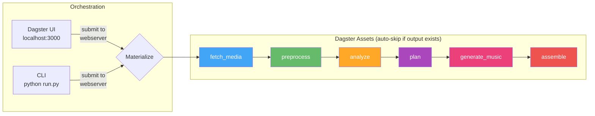

# vlog

Automated vlog generation from Synology Photos. Downloads trip photos/videos, plans a narrative with Gemini (which sees actual photos and listens to video clips), generates background music via Gemini Lyria RealTime, and renders a polished highlight reel. Orchestrated by [Dagster](https://dagster.io) with a web UI.

## Architecture



## Quick Start

### Prerequisites

- **Python 3.11+** — [python.org/downloads](https://www.python.org/downloads/)
- **Git** — for cloning repos
- **Synology NAS** with Photos enabled (for the media source)
- **Gemini API key** — free, get one at [ai.google.dev](https://ai.google.dev/) → "Get API key"

FFmpeg is also needed but `start.py` will offer to install it for you.

### 1. Clone and setup

```bash
git clone <this-repo-url>
cd vlog

# First run: creates venvs, installs all deps, walks you through .env config, starts services
python start.py
```

The setup wizard will prompt you for:
- Synology NAS IP, port, and credentials
- Gemini API key (paste the key from ai.google.dev)
- Other settings with sensible defaults — just press Enter

On first run, `start.py` will:
1. Clone [synology-photos-project](../synology-photos-project) if missing
2. Check for FFmpeg (offers to auto-install via winget/brew/apt)
3. Create Python venvs and install all dependencies (Dagster, google-genai, etc.)
4. Walk you through `.env` configuration (NAS credentials, Gemini API key)

Subsequent runs (`python start.py`) skip setup and just start services:
```
=== Services Ready ===
  Synology Photos API:  http://localhost:8000
  Dagster UI:           http://localhost:3000
```

### 2. Activate the venv

`start.py` installs all dependencies into a local `venv/`, not system Python. **Always activate it before running `run.py`:**

```bash
# Windows
venv\Scripts\activate

# macOS / Linux
source venv/bin/activate
```

Your prompt should now show `(venv)`. All `python run.py` commands below assume the venv is activated.

### 3. Run the pipeline

```bash
# Defaults: Gemini music, 4K 60fps — just add dates and focus
python run.py -n singapore full -f 2025-06-13 -t 2025-06-17 \
  --duration 180 --style cinematic \
  --focus "happiness of family trip; exotic scenes of Singapore"
```

### 4. Monitor in Dagster UI

Open **http://localhost:3000** — the CLI prints a direct link to each run:
```
Run submitted: 94f28746-9f4d-4399-90bf-2da7d485fbf0
View at: http://localhost:3000/runs/94f28746-...
```

### Iteration workflow

Use low-res previews to iterate on narrative/selection quickly, then do a final 4K render:

```bash
# 1. Fast preview (~1min render, ~20MB file) — check if story works
python run.py -n sg-draft full -f 2025-06-13 -t 2025-06-17 \
  --duration 180 --style energetic \
  --width 640 --height 360 --fps 15 --quality 0.3

# 2. Happy with the edit? Re-plan with tweaks if needed
python run.py -n sg-draft plan --style cinematic --duration 120

# 3. Final 4K render (default settings)
python run.py -n sg-final full -f 2025-06-13 -t 2025-06-17 \
  --duration 180 --style energetic

# Stop all services when done
python start.py stop
```

## Workspace Structure

```
workspace/
  media/                          <- shared: raw photos/videos (downloaded once)
  analysis_cache/                 <- shared: per-file vision results ({item_id}.json)
  keyframes/                      <- shared: extracted video keyframes
  music/                          <- shared: generated music tracks (cached)
  runs/
    singapore/                    <- per-run: isolated pipeline outputs
      manifest.json
      preprocessed.json
      analysis.json
      edl_v1.json, edl_v2.json   <- versioned EDLs
      contact_sheets/             <- contact sheet grids sent to Gemini
      clips/
      output/vlog_v1.mp4, ...    <- versioned outputs
      output/chapters_v1.txt     <- YouTube chapter markers
    singapore-cinematic/          <- another run, same source data
      ...
```

Media files, analysis results, and music tracks are shared across runs. A second run for the same trip reuses all downloads and music — only plan + assemble re-run.

## Usage

### Commands

All CLI commands submit to the Dagster webserver — runs appear in the UI at http://localhost:3000.

| Command | Description |
|---------|-------------|
| `python run.py -n <name> full ...` | Run the full pipeline end-to-end |
| `python run.py -n <name> resume` | Resume — auto-skips completed stages |
| `python run.py -n <name> plan ...` | Re-plan + re-assemble (reuses cached media) |
| `python run.py -n <name> assemble` | Re-render from current EDL |
| `python run.py workspace` | Show disk usage |
| `python run.py workspace --clean all -y` | Delete all workspace data |
| `python start.py stop` | Stop all services |

The `-n` / `--run-name` flag is required for most commands. It isolates each run in its own directory under `workspace/runs/<name>/`.

### Full pipeline flags

```
python run.py -n <name> full [OPTIONS]
```

**Required:**

| Flag | Description |
|------|-------------|
| `-f` / `--from-date` | Start date (`YYYY-MM-DD`) |
| `-t` / `--to-date` | End date (`YYYY-MM-DD`) |

**Content selection:**

| Flag | Default | Values | Description |
|------|---------|--------|-------------|
| `--trip-type` | `family` | `family`, `solo`, `food`, `adventure`, `architecture`, `general` | Controls scoring profile, narrative style, and music mood templates |
| `--item-types` | all | `photo`, `video`, `live`, `motion` (comma-separated) | Media types to fetch from NAS. Omit to include everything |
| `--country` | — | any string | Filter by country (e.g. `Singapore`) |
| `--district` | — | any string | Filter by district/city (e.g. `"Marina Bay"`) |
| `--focus` | derived from trip-type | free text | What to emphasize (e.g. `"family happiness; exotic street food"`) |

**Planning:**

| Flag | Default | Values | Description |
|------|---------|--------|-------------|
| `--style` | `upbeat` | `upbeat`, `cinematic`, `reflective`, `energetic` | Controls pacing, transitions, and music mood |
| `--duration` | `60` | seconds | Target vlog length. 60 = ~1 min, 180 = ~3 min |

**Music:**

| Flag | Default | Values | Description |
|------|---------|--------|-------------|
| `--music` | `auto` | `auto`, `local`, `/path/to/file`, `none` | `auto` = Gemini Lyria RealTime (~8s). `local` = MusicGen (~20 min, no API). Path = custom file. `none` = silent |

**Output:**

| Flag | Default | Values | Description |
|------|---------|--------|-------------|
| `--width` | `3840` | pixels | Output video width |
| `--height` | `2160` | pixels | Output video height |
| `--fps` | `60` | frames/sec | Output frame rate |
| `--quality` | `1.0` | float | Bitrate multiplier. Scales the base bitrate for the given resolution/fps |

Quality presets and resulting bitrates:

| `--quality` | Use case | 4K 60fps | 1080p 30fps | 720p 30fps |
|-------------|----------|----------|-------------|------------|
| `0.5` | Draft / quick share | 33 Mbps | 4 Mbps | 2 Mbps |
| `1.0` | YouTube upload (default) | 67 Mbps | 8 Mbps | 5 Mbps |
| `1.5` | High quality archive | 100 Mbps | 12 Mbps | 7 Mbps |
| `2.0` | Master / editing source | 134 Mbps | 16 Mbps | 10 Mbps |

**Advanced:**

| Flag | Default | Description |
|------|---------|-------------|
| `--family` | auto-detect | Comma-separated family member names for tiering (e.g. `"Yi Zhang,Liang Guo,Yuer Guo"`). Default: auto-detected from NAS face recognition data |
| `--force-analyze` | off | Force re-run analysis (ignore cached `analysis.json`) |

### Examples

**Family trip highlight reel:**
```bash
python run.py -n singapore full -f 2025-06-13 -t 2025-06-17 \
  --duration 180 --style cinematic \
  --focus "happiness of family trip; exotic scenes of Singapore"
```

**Quick preview (low res, draft quality):**
```bash
python run.py -n sg-test full -f 2025-06-13 -t 2025-06-16 \
  --duration 60 --width 640 --height 360 --fps 15 --quality 0.5
```

**Solo travel montage:**
```bash
python run.py -n tokyo full -f 2025-03-01 -t 2025-03-05 \
  --trip-type solo --style energetic --duration 120 \
  --focus "street culture, neon lights, temple serenity"
```

**Food tour:**
```bash
python run.py -n osaka-food full -f 2025-04-10 -t 2025-04-12 \
  --trip-type food --style upbeat --duration 90 \
  --focus "street food, ramen, izakaya atmosphere"
```

**Architecture documentary (master quality):**
```bash
python run.py -n barcelona full -f 2025-05-01 -t 2025-05-04 \
  --trip-type architecture --style cinematic --duration 120 \
  --focus "Gaudi, Gothic Quarter, modernist facades" --quality 2.0
```

**Photos only, no music:**
```bash
python run.py -n sg-photos full -f 2025-06-13 -t 2025-06-17 \
  --item-types photo --duration 60 --music none
```

**Re-plan with different style (keeps cached media):**
```bash
python run.py -n singapore plan --style reflective --duration 120
```

### Web UI (Dagster)

After `python start.py`, open **http://localhost:3000**.

Pipeline graph: `fetch_media -> preprocess -> analyze -> plan -> generate_music -> assemble`

**Run the full pipeline:** Jobs -> full_pipeline -> Launchpad -> paste config.

**Resume:** Materialize All with defaults — auto-skips stages with existing outputs.

**Monitor progress:** Run event log shows per-item status for every stage, with ETA for analyze and assemble.

## Pipeline Stages

### 1. fetch_media
Downloads photos/videos from Synology Photos API, filtered by date range, location, person IDs, and item types.

### 2. preprocess
Assigns tiers based on family member presence (from Synology face detection) and builds a day/time_block/location timeline. All items are sent forward — Gemini handles deduplication visually.

| Tier | Criteria | Role |
|------|----------|------|
| A | 2+ family members | Emotional core |
| B | 1 family member | Supporting |
| C | 0 family members + has location or is video | B-roll / scenery |
| D | Screenshots, no location | Skipped |

### 3. analyze
Generates thumbnails for photos (via Pillow) and keyframes for videos (single FFmpeg pass per video). No local AI models needed — Gemini sees the actual images in the plan stage. Fast (~1-2min for 300 items). All results cached per-file in the shared `analysis_cache/` directory.

### 4. plan
Gemini sees actual photos via contact sheets and listens to video clips (with audio). 3-pass planning:

1. **Arc** (text-only) — design narrative structure and chapter themes
2. **Select** (contact sheets + video clips + metadata) — see ALL photos/videos, pick items, assign music_mood, set `keep_audio`/`playback_speed`/transitions/color_temp
3. **Review** (selected items at 768px) — refine pacing, check video/photo balance, adjust trim points

Outputs versioned EDL (`edl_v{N}.json`) with: `music_mood` per segment, `narrative_rationale`, video trim points (`start_time`/`end_time`), `keep_audio`, `transcript`, `playback_speed`, transition type, segment `mode` (narrative/montage), and `color_temp`. Requires `GEMINI_API_KEY`.

### 5. generate_music
Generates background music using the EDL's `music_mood` descriptions and `estimated_duration()`. See [Music Generation](#music-generation) for backend options. Saves the music file path back into the EDL. Skipped when `--music none` or a custom file path is provided.

### 6. assemble
Renders each item as a video clip (Ken Burns effects for photos, trimmed clips for videos with `start_time`/`end_time` and `playback_speed`), applies subtle color grading and per-segment `color_temp`, adds text overlays, concatenates with varied transitions (crossfade, dissolve, smoothleft, smoothright, circlecrop, fade_black, wipe_left — Gemini-driven per segment). Supports montage mode segments (quick-cut bursts). Mixes in the music track with audio ducking (music volume drops during speech clips where `keep_audio=true`). Renders intro/outro title cards. Outputs YouTube chapter markers (`chapters_v{N}.txt`). FFmpeg subprocesses have a 5-minute timeout to prevent hanging on corrupt files.

## Trip Types & Scoring

Each trip type has a different narrative guidance that affects how Gemini selects and groups items:

| Trip Type | Focus | Narrative guidance |
|-----------|-------|-------------------|
| family | Family happiness | 30-40% family close-ups, genuine laughter, shared meals |
| solo | Personal journey | Grand landscapes, solitary wonder, quality over people |
| food | Culinary experiences | Close-ups of dishes, market stalls, restaurant ambiance |
| adventure | Action and awe | Dramatic pacing, movement, discovery, nature |
| architecture | Design and space | Buildings, structures, visual quality, striking compositions |
| general | Balanced highlights | Mix people/places/moments, variety and quality |

## Music Generation

The `generate_music` pipeline step creates background music before assembly. Controlled by the `--music` flag:

| `--music` | Backend | Speed | Quality | Setup |
|-----------|---------|-------|---------|-------|
| `auto` (default) | Gemini Lyria RealTime | ~8s for 60s | 48kHz stereo | `GEMINI_API_KEY` (same key used for planning) |
| `local` | MusicGen (facebook/musicgen-medium) | ~20 min for 60s | 32kHz mono | `pip install -e ".[music]"` + ~6GB model |
| `/path/to/file` | Custom file | instant | — | — |
| `none` | No music | — | — | — |

```bash
# Gemini Lyria RealTime (default — fast, high quality)
python run.py -n sg full ... --music auto

# Local MusicGen (no API key needed for music, but slow)
python run.py -n sg full ... --music local

# Custom music file (skip generation entirely)
python run.py -n sg full ... --music /path/to/soundtrack.mp3

# No music
python run.py -n sg full ... --music none
```

Both backends use the `music_mood` from EDL segments (set by Gemini during planning) as the generation prompt, with fallback templates per trip_type + style. Generated tracks are cached in `workspace/music/` — subsequent runs with the same parameters reuse them instantly.

## Requirements

- **Python 3.11+** with venv
- **FFmpeg** — video processing
- **Synology Photos API** — the [synology-photos-project](../synology-photos-project) backend running on `:8000`
- **Gemini API key** — for planning and music generation (`GEMINI_API_KEY` in `.env`)

All of the above (venvs, deps, Dagster, services) are handled by `python start.py`. You do not need to pip install manually.

Optional (installed with `pip install -e ".[music]"` inside the venv):
- **PyTorch + transformers + scipy** — local MusicGen music generation (`--music local`)

Other optional extras:
- **pillow-heif** — HEIC/HEIF photo support (`pip install -e ".[heic]"`)
- **opencv-python-headless** — face-aware crop in assemble (`pip install -e ".[cv]"`)

### Platform Notes

| Feature | macOS | Windows | Linux |
|---------|-------|---------|-------|
| HEIC photos | Built-in (sips) | `pip install pillow-heif` | `pip install pillow-heif` |
| MusicGen | Works | Works | Works |
| FFmpeg | `brew install ffmpeg` | [ffmpeg.org/download](https://ffmpeg.org/download.html) | `apt install ffmpeg` |
| GPU encoding | VideoToolbox (auto) | NVENC (auto-detected) | NVENC (auto-detected) |

### Resource usage

| Component | Model | RAM | Notes |
|-----------|-------|-----|-------|
| Planning | Gemini 3 Flash (remote) | — | Sees actual photos + listens to video clips |
| Music (default) | Lyria RealTime (remote) | — | `--music auto` |
| Music (local) | MusicGen medium | ~6GB | `--music local` |

With defaults, no local AI models are needed — everything runs via Gemini API.

## Testing

```bash
# Activate venv first (Windows: venv\Scripts\activate)
source venv/bin/activate

python -m pytest tests/ -v -m "not integration"  # unit/mocked tests (~1s)
python -m pytest tests/ -v -m integration         # integration tests (requires FFmpeg + GEMINI_API_KEY)
python -m pytest tests/ -v                         # all tests
```

Integration tests for Gemini music generation (`tests/test_music.py::TestFetchMusicGeminiE2E`) require `GEMINI_API_KEY` in `.env` and make real API calls.

## Key design decisions

- **Dagster asset model** — each stage is a Dagster asset that produces a file. Auto-skips when output exists. Re-materialize from the UI to force re-run + downstream cascade.
- **Trip-type generalization** — narrative prompts and music prompts all adapt to trip type. The same pipeline handles family trips, solo adventures, food tours, etc.
- **Gemini visual planning** — Gemini 3 Flash sees actual photos via contact sheets and listens to video clips (with audio) via short MP4 samples. 3-pass planning: arc design -> shot selection -> self-review.
- **Music as a separate asset** — `generate_music` runs between plan and assemble as its own Dagster step. Plan declares intent (`music_mode=auto`) and mood; `generate_music` produces the audio; assemble mixes it into the video.
- **Audio ducking** — music volume automatically drops during clips where Gemini detected meaningful speech (`keep_audio=true`), so original audio is clearly audible.
- **Shared media + analysis cache** — raw files and per-file results are shared across runs. Only plan + assemble re-run.
- **Per-run isolation** — each run gets its own directory for manifest, EDL, clips, and output.
- **Interruptible everything** — all FFmpeg calls use `Popen` with signal forwarding and a 5-minute timeout.
- **EDL is the central artifact** — a JSON file that flows between plan/generate_music/assemble. Changing the edit never re-analyzes media.
- **Content-aware rendering** — Ken Burns effects for photos (face-aware crop), portrait mode (blurred background + sharp foreground), speed ramps, varied transitions, subtle color grading with per-segment temperature.
- **YouTube chapter markers** — `chapters_v{N}.txt` output with timestamps for each segment.
- **HEIC conversion** — Apple HEIC photos are converted via pillow-heif (cross-platform), macOS sips, or ImageMagick, whichever is available.
