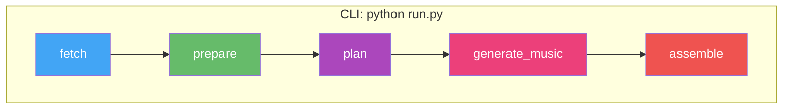

# vlog

Automated vlog generation from photos and videos. Fetches media from a local folder or Synology NAS, plans a narrative with Gemini (which sees actual photos and listens to video audio), generates background music via Gemini Lyria RealTime, and renders a polished highlight reel.

## Architecture



## Quick Start

### Prerequisites

- **Python 3.11+** — [python.org/downloads](https://www.python.org/downloads/)
- **FFmpeg** — video processing (`brew install ffmpeg` / `apt install ffmpeg` / [ffmpeg.org](https://ffmpeg.org/download.html))
- **Gemini API key** — get one at [ai.google.dev](https://ai.google.dev/) → "Get API key"
- **Synology NAS** with Photos enabled (when using `--source nas`)

### 1. Clone and install

```bash
git clone <this-repo-url>
cd vlog
python -m venv venv

# Windows
venv\Scripts\activate
# macOS / Linux
source venv/bin/activate

pip install -e .
```

### 2. Configure

Create a `.env` file with your API key:

```
GEMINI_API_KEY=your-key-here
```

For NAS usage, also add:
```
SYNOLOGY_BASE_URL=http://your-nas-ip:port
SYNOLOGY_USER=your-user
SYNOLOGY_PASS=your-pass
```

### 3. Run the pipeline

```bash
# Full pipeline from local photos
python run.py -n singapore full -s local -p ./photos -r 4k60 \
  --duration 180 --style cinematic \
  --focus "happiness of family trip; exotic scenes of Singapore"

# Full pipeline from NAS
python run.py -n singapore full -s nas -f 2025-06-13 -t 2025-06-17 -r 1080p30 \
  --duration 180 --lang cn
```

### Iteration workflow

Use low-res to iterate quickly, then do a final 4K render:

```bash
# 1. Fast preview (~1min render) — check if story works
python run.py -n sg-draft full -s nas -f 2025-06-13 -t 2025-06-17 -r 720p30 \
  --duration 180 --style energetic --quality 0.3

# 2. Happy with the edit? Re-plan with tweaks
python run.py -n sg-draft plan --style cinematic --duration 120

# 3. Final 4K render
python run.py -n sg-draft assemble -r 4k60
```

## Commands

| Command | Description |
|---------|-------------|
| `python run.py -n <name> full ...` | Full pipeline end-to-end |
| `python run.py -n <name> prepare ...` | Fetch + prepare media only |
| `python run.py -n <name> plan ...` | Re-plan (reuses cached media) |
| `python run.py -n <name> assemble -r <res>` | Re-render from current EDL |
| `python run.py workspace` | Show disk usage |
| `python run.py workspace --clean all -y` | Delete all workspace data |

The `-n` / `--run-name` flag isolates each run in `workspace/runs/<name>/`.

### Full pipeline flags

```
python run.py -n <name> full [OPTIONS]
```

**Source (required):**

| Flag | Description |
|------|-------------|
| `-s` / `--source` | `local` or `nas` |
| `-p` / `--path` | Local folder path (required when `-s local`) |
| `-f` / `--from-date` | NAS start date YYYY-MM-DD (required when `-s nas`) |
| `-t` / `--to-date` | NAS end date YYYY-MM-DD (required when `-s nas`) |

**Resolution (required):**

| Flag | Description |
|------|-------------|
| `-r` / `--resolution` | Preset (`4k60`, `4k30`, `2k60`, `2k30`, `1080p60`, `1080p30`, `720p30`) or custom `WxHxFPS` (e.g. `2560x1440x60`) |

**Content selection:**

| Flag | Default | Values | Description |
|------|---------|--------|-------------|
| `--trip-type` | `family` | `family`, `solo`, `food`, `adventure`, `architecture`, `general` | Narrative style and music mood |
| `--item-types` | all | `photo`, `video`, `live`, `motion` (comma-separated) | Media types to fetch from NAS |
| `--country` | — | any string | NAS filter by country |
| `--district` | — | any string | NAS filter by district/city |
| `--focus` | — | free text | What to emphasize (e.g. `"family happiness; street food"`) |
| `--lang` | `en` | `en`, `cn`, `both` | Text language for title, overlays, chapters |

**Planning:**

| Flag | Default | Values | Description |
|------|---------|--------|-------------|
| `--style` | `upbeat` | `upbeat`, `cinematic`, `reflective`, `energetic` | Pacing, transitions, music mood |
| `--duration` | `60` | seconds | Target vlog length |

**Music:**

| Flag | Default | Values | Description |
|------|---------|--------|-------------|
| `--music` | `auto` | `auto`, `/path/to/file`, `none` | `auto` = Gemini Lyria (~8s). Path = custom file |

**Other:**

| Flag | Description |
|------|-------------|
| `--quality` | Bitrate multiplier: `0.5` = draft, `1.0` = YouTube (default), `2.0` = master |
| `--tz` | UTC offset in hours (e.g. `8` for SGT, `-5` for NYC). Default: system local |
| `--force` | Force re-analyze (ignore cached analysis.json) |
| `--model` | Override Gemini model (default: `gemini-3-flash-preview` or `VLOG_MODEL` env var) |

### Examples

**Family trip, cinematic, Chinese overlays:**
```bash
python run.py -n singapore full -s local -p ./photos -r 4k60 \
  --duration 180 --style cinematic --lang cn \
  --focus "family reunion joy, parents exploring Singapore for the first time"
```

**Solo travel montage from NAS:**
```bash
python run.py -n tokyo full -s nas -f 2025-03-01 -t 2025-03-05 -r 1080p30 \
  --trip-type solo --style energetic --duration 120 \
  --focus "street culture, neon lights, temple serenity"
```

**Re-plan with different style (keeps cached media):**
```bash
python run.py -n singapore plan --style reflective --duration 120
```

## Workspace Structure

```
workspace/
  -- Shared across all runs (cached, reused) --
  media/                          <- raw photos/videos (downloaded once)
  analysis_cache/                 <- per-file prepare results ({item_id}.json)
  thumbnails/                     <- 600px JPEG thumbnails (prepare stage)
  preview_clips/                  <- 360p 1fps MP4 previews sent to Gemini
  music/                          <- generated music tracks (Lyria/MusicGen)

  -- Per-run (isolated pipeline outputs) --
  runs/
    singapore/
      manifest.json               <- fetched items list
      preprocessed.json           <- family names + timeline
      analysis.json               <- per-item metadata (media type, duration, EXIF)
      edl_v1.json, edl_v2.json   <- versioned EDLs from Gemini
      clips/                      <- rendered clips (resolution-tagged, e.g. seg00_item00_1080p30.mp4)
      output/
        vlog_v1_1080p30.mp4      <- final rendered vlog (resolution in filename)
        chapters_v1_1080p30.txt  <- YouTube chapter markers
        ffmpeg_commands.log      <- all FFmpeg commands for debugging
      run_*.log                   <- pipeline log
      run_status.json             <- stage status summary
```

Shared files are reused across runs — a second run for the same trip skips media download, thumbnails, and preview clip generation.

## Pipeline Stages

### 1. fetch
Downloads photos/videos from Synology Photos API (filtered by date range, location, item types) or copies from a local folder.

### 2. prepare
Processes media for visual planning:
- Family member auto-detection from NAS face recognition data
- Timeline construction (day / time_block / location)
- Photo thumbnails (600px, cached per-file)
- EXIF extraction (cached per-file)
- Video duration probing (cached per-file)

### 3. plan
Gemini sees actual photos (400px thumbnails inline) and watches/listens to video clips (one concatenated 360p 1fps mega-preview via Files API). Single-pass planning with chain-of-thought:
- Designs narrative arc (chapters by story beat, not location)
- Selects photos/videos, assigns trim points, speed ramps, transitions, color temperature
- Sets `keep_audio=true` on videos with meaningful speech/laughter
- Self-reviews pacing, variety, and video/photo balance

Prompts are externalized to `pipeline/prompts/` (editable without code changes). Fault tolerance includes fuzzy path matching for hallucinated file paths, trim point clamping, and duration validation with optional follow-up Gemini call.

Outputs versioned EDL (`edl_v{N}.json`). Requires `GEMINI_API_KEY`.

### 4. generate_music
Generates background music from EDL `music_mood` descriptions. Skipped when `--music none` or a custom file path is provided.

| `--music` | Backend | Speed | Quality |
|-----------|---------|-------|---------|
| `auto` (default) | Gemini Lyria RealTime | ~8s for 60s | 48kHz stereo |

### 5. assemble
Renders the final video in 4 phases:

1. **Clip rendering** — parallel via `parallel.run_parallel()` (3 NVENC / 2 VideoToolbox / cpu_count/2 libx264 workers). Photos get Ken Burns effects, videos trimmed with speed ramps. Clips cached per resolution.
2. **Concatenation** — segment-level xfade transitions (groups of ≤10 clips for reliability). 8 transition types: crossfade, dissolve, smoothleft, smoothright, circlecrop, fade_black, wipe_left, fadewhite.
3. **Audio mixing** — music + speech with ducking (music ramps to 30% during speech). Title cards for intro/outro.
4. **Validation** — 6 automated checks (file size, duration, streams, codec, A/V sync, resolution).

All FFmpeg commands logged to `output/ffmpeg_commands.log`.

## Trip Types

Narrative guidance per trip type (editable in `pipeline/prompts/narrative_guidance.json`):

| Trip Type | Focus |
|-----------|-------|
| family | Family close-ups, genuine laughter, shared meals |
| solo | Grand landscapes, solitary wonder, personal journey |
| food | Dish close-ups, market stalls, restaurant ambiance |
| adventure | Dramatic pacing, movement, discovery, nature |
| architecture | Buildings, structures, striking compositions |
| general | Balanced mix of people, places, moments |

## Requirements

- **Python 3.11+** with venv
- **FFmpeg** — video processing (auto-detected: HEVC on GPU, H.264 on CPU)
- **Gemini API key** — `GEMINI_API_KEY` in `.env`
- **Synology Photos API** — only for `--source nas` (the [synology-photos-project](../synology-photos-project) backend)

No local AI models needed — everything runs via Gemini API.

### Platform Notes

| Feature | macOS | Windows | Linux |
|---------|-------|---------|-------|
| HEIC photos | Built-in | pillow-heif (bundled) | pillow-heif (bundled) |
| GPU encoding | VideoToolbox (auto) | NVENC (auto) | NVENC (auto) |
| CPU fallback | libx264 | libx264 | libx264 |

### Resource usage

| Component | Model | RAM | Notes |
|-----------|-------|-----|-------|
| Planning | Gemini 3 Flash (remote) | — | Sees photos + listens to videos |
| Music | Lyria RealTime (remote) | — | `--music auto` |

## Testing

```bash
source venv/bin/activate  # Windows: venv\Scripts\activate

python -m pytest tests/ -m "not integration"    # unit tests (~2s, 232 tests)
python -m pytest tests/ -m integration           # integration tests (requires FFmpeg)
python -m pytest tests/                           # all tests (255 tests)
```

## Key design decisions

- **Single-process CLI** — no external services needed. Each stage caches its output; re-running is fast.
- **Modular assemble** — split into encoder, filters, render, concat, audio, grouping, parallel modules. assemble.py is pure orchestration.
- **RenderContext** — per-run state object (encoder detection + ffprobe cache) replaces scattered globals.
- **Externalized prompts** — Gemini prompts live in `pipeline/prompts/` as .md/.json files, editable without code changes.
- **Gemini fault tolerance** — fuzzy path matching, trim point clamping, deduplication, duration validation.
- **Post-assemble validation** — 6 automated checks catch issues before manual review.
- **Shared parallel runner** — `parallel.run_parallel()` with batching and interrupt handling, used by both plan and assemble.
- **Content-aware rendering** — Ken Burns effects for photos, portrait mode (blurred background), speed ramps, varied transitions, color grading with per-segment temperature.
- **Resolution-tagged caching** — clips tagged per resolution (`seg00_item00_1080p30.mp4`); switching resolution doesn't invalidate existing clips.
