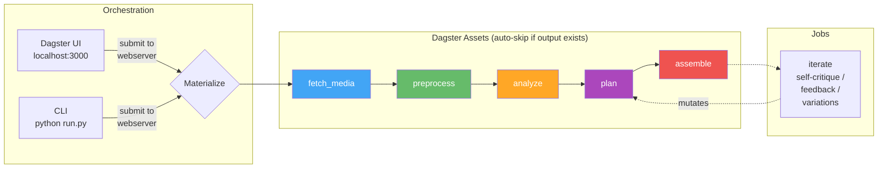

# vlog

Automated vlog generation from Synology Photos. Downloads trip photos/videos, plans a narrative with AI (Gemini), generates background music (locally via MusicGen or via Gemini Lyria RealTime API), and renders a highlight reel. Three planning modes: **visual** (Gemini sees actual photos — fastest), **api** (Gemini text-only), **algo** (deterministic scoring). Orchestrated by [Dagster](https://dagster.io) with a web UI.

## Architecture



## Quick Start

### Prerequisites

- **Python 3.11+** — [python.org/downloads](https://www.python.org/downloads/)
- **Git** — for cloning repos
- **Synology NAS** with Photos enabled (for the media source)
- **Gemini API key** — free, get one at [ai.google.dev](https://ai.google.dev/) → "Get API key"

FFmpeg and Ollama are also needed but `start.py` will offer to install them for you.

### 1. Clone and setup

```bash
git clone <this-repo-url>
cd vlog

# First run: creates venvs, installs all deps, walks you through .env config, starts services
python start.py
```

The setup wizard will prompt you for:
- Synology NAS IP, port, and credentials
- Gemini API key (paste the key from ai.google.dev)
- Other settings with sensible defaults — just press Enter

On first run, `start.py` will:
1. Clone [synology-photos-project](../synology-photos-project) if missing
2. Check for FFmpeg and Ollama (offers to auto-install via winget/brew/apt)
3. Create Python venvs and install all dependencies (Dagster, google-genai, etc.)
4. Walk you through `.env` configuration
5. Pull required Ollama models
6. Start Ollama, Synology Photos API, and Dagster

Subsequent runs (`python start.py`) skip setup and just start services:
```
=== Services Ready ===
  Ollama:               http://localhost:11434
  Synology Photos API:  http://localhost:8000
  Dagster UI:           http://localhost:3000
```

### 2. Activate the venv

`start.py` installs all dependencies into a local `venv/`, not system Python. **Always activate it before running `run.py`:**

```bash
# Windows
venv\Scripts\activate

# macOS / Linux
source venv/bin/activate
```

Your prompt should now show `(venv)`. All `python run.py` commands below assume the venv is activated.

### 3. Run the pipeline

```bash
# Full AI-driven pipeline (visual planner + Gemini music, recommended)
python run.py -n singapore full -f 2025-06-13 -t 2025-06-17 \
  --trip-type family --planner visual --duration 180 \
  --music auto --music-backend gemini \
  --focus "happiness of family trip; exotic scenes of Singapore"
```

### 4. Monitor in Dagster UI

Open **http://localhost:3000** — the CLI prints a direct link to each run:
```
Run submitted: 94f28746-9f4d-4399-90bf-2da7d485fbf0
View at: http://localhost:3000/runs/94f28746-...
```

### More examples

```bash
# Local MusicGen instead of Gemini (no API, but ~20min for 60s of audio)
python run.py -n singapore full -f 2025-06-13 -t 2025-06-17 \
  --trip-type family --planner visual --duration 180 --music auto

# Quick test (low res, fast)
python run.py -n sg-test full -f 2025-06-13 -t 2025-06-16 \
  --planner visual --duration 60 --item-types photo \
  --width 640 --height 360 --fps 15

# Stop all services when done
python start.py stop
```

## Workspace Structure

```
workspace/
  media/                          <- shared: raw photos/videos (downloaded once)
  analysis_cache/                 <- shared: per-file vision results ({item_id}.json)
  keyframes/                      <- shared: extracted video keyframes
  music/                          <- shared: generated music tracks (cached)
  runs/
    singapore/                    <- per-run: isolated pipeline outputs
      manifest.json
      preprocessed.json
      analysis.json
      edl_v1.json, edl_v2.json   <- versioned EDLs
      clips/
      output/vlog_v1.mp4, ...    <- versioned outputs
    singapore-cinematic/          <- another run, same source data
      ...
```

Media files, analysis results, and music tracks are shared across runs. A second run for the same trip reuses all downloads, vision results, and music — only plan + assemble re-run.

## Usage

### Commands

All CLI commands submit to the Dagster webserver — runs appear in the UI at http://localhost:3000.

| Command | Description |
|---------|-------------|
| `python run.py -n <name> full ...` | Run the full pipeline end-to-end |
| `python run.py -n <name> resume` | Resume — auto-skips completed stages |
| `python run.py -n <name> plan ...` | Re-plan + re-assemble (reuses cached media) |
| `python run.py -n <name> assemble` | Re-render from current EDL |
| `python run.py -n <name> iterate ...` | Self-critique or apply human feedback |
| `python run.py -n <name> variations` | Generate multiple style variations |
| `python run.py workspace` | Show disk usage |
| `python run.py workspace --clean all -y` | Delete all workspace data |
| `python start.py stop` | Stop all services |

The `-n` / `--run-name` flag is required for most commands. It isolates each run in its own directory under `workspace/runs/<name>/`.

### Full pipeline flags

```
python run.py -n <name> full [OPTIONS]
```

**Required:**

| Flag | Description |
|------|-------------|
| `-f` / `--from-date` | Start date (`YYYY-MM-DD`) |
| `-t` / `--to-date` | End date (`YYYY-MM-DD`) |

**Content selection:**

| Flag | Default | Values | Description |
|------|---------|--------|-------------|
| `--trip-type` | `family` | `family`, `solo`, `food`, `adventure`, `architecture`, `general` | Controls scoring profile, narrative style, and music mood templates |
| `--item-types` | all | `photo`, `video`, `live`, `motion` (comma-separated) | Media types to fetch from NAS. Omit to include everything |
| `--country` | — | any string | Filter by country (e.g. `Singapore`) |
| `--district` | — | any string | Filter by district/city (e.g. `"Marina Bay"`) |
| `--focus` | derived from trip-type | free text | What to emphasize (e.g. `"family happiness; exotic street food"`) |

**Planning:**

| Flag | Default | Values | Description |
|------|---------|--------|-------------|
| `--planner` | `visual` | `visual`, `api`, `algo` | `visual` = Gemini sees actual photos (recommended, fast). `api` = Gemini plans from text descriptions. `algo` = deterministic scoring |
| `--style` | `upbeat` | `upbeat`, `cinematic`, `reflective`, `energetic` | Controls pacing, transitions, and music mood |
| `--duration` | `60` | seconds | Target vlog length. 60 = ~1 min, 180 = ~3 min |

**Music:**

| Flag | Default | Values | Description |
|------|---------|--------|-------------|
| `--music` | none | `auto` or `/path/to/file` | `auto` = generate background music. Path = use custom audio file. Omit = no music |
| `--music-backend` | `local` | `local`, `gemini` | `local` = MusicGen (slow, ~20 min/60s, no API). `gemini` = Lyria RealTime (fast, ~8s/60s, uses `GEMINI_API_KEY`) |

**Output:**

| Flag | Default | Values | Description |
|------|---------|--------|-------------|
| `--width` | `3840` | pixels | Output video width |
| `--height` | `2160` | pixels | Output video height |
| `--fps` | `60` | frames/sec | Output frame rate |

**Advanced:**

| Flag | Default | Description |
|------|---------|-------------|
| `--family` | auto-detect | Comma-separated family member names for tiering (e.g. `"Yi Zhang,Liang Guo,Yuer Guo"`). Default: auto-detected from NAS face recognition data |
| `--force-analyze` | off | Force re-run analysis (ignore cached `analysis.json`) |

### Examples

**Family trip highlight reel (recommended settings):**
```bash
# 3-minute cinematic family vlog with AI music — the "batteries included" command
python run.py -n singapore full -f 2025-06-13 -t 2025-06-17 \
  --trip-type family --planner visual --duration 180 \
  --style cinematic --music auto --music-backend gemini \
  --focus "happiness of family trip; exotic scenes of Singapore"
```

**Quick preview (low res, fast iteration):**
```bash
python run.py -n sg-test full -f 2025-06-13 -t 2025-06-16 \
  --planner visual --duration 60 \
  --width 640 --height 360 --fps 15
```

**Solo travel montage:**
```bash
python run.py -n tokyo full -f 2025-03-01 -t 2025-03-05 \
  --trip-type solo --style energetic --duration 120 \
  --planner visual --music auto --music-backend gemini \
  --focus "street culture, neon lights, temple serenity"
```

**Food tour:**
```bash
python run.py -n osaka-food full -f 2025-04-10 -t 2025-04-12 \
  --trip-type food --style upbeat --duration 90 \
  --planner visual --music auto --music-backend gemini \
  --focus "street food, ramen, izakaya atmosphere"
```

**Architecture documentary:**
```bash
python run.py -n barcelona full -f 2025-05-01 -t 2025-05-04 \
  --trip-type architecture --style cinematic --duration 120 \
  --planner visual --music auto --music-backend gemini \
  --focus "Gaudí, Gothic Quarter, modernist facades"
```

**Photos only (no video clips):**
```bash
python run.py -n sg-photos full -f 2025-06-13 -t 2025-06-17 \
  --item-types photo --planner visual --duration 60
```

**Re-plan with different style (keeps cached media):**
```bash
python run.py -n singapore plan --style reflective --duration 120
```

**Iterate with feedback:**
```bash
python run.py -n singapore iterate --feedback "more family close-ups, less scenery"
```

**Generate style variations:**
```bash
python run.py -n singapore variations --styles "energetic,reflective,cinematic"
```

### Web UI (Dagster)

After `python start.py`, open **http://localhost:3000**.

Pipeline graph: `fetch_media → preprocess → analyze → plan → generate_music → assemble`

**Run the full pipeline:** Jobs → full_pipeline → Launchpad → paste config.

**Resume:** Materialize All with defaults — auto-skips stages with existing outputs.

**Monitor progress:** Run event log shows per-item status for every stage, with ETA for analyze and assemble.

## Pipeline Stages

### 1. fetch_media
Downloads photos/videos from Synology Photos API, filtered by date range, location, person IDs, and item types.

### 2. preprocess
Assigns tiers based on family member presence (from Synology face detection), clusters near-duplicates using time proximity + HSV histogram similarity, and builds a day/time_block/location timeline.

| Tier | Criteria | Role |
|------|----------|------|
| A | 2+ family members | Emotional core |
| B | 1 family member | Supporting |
| C | 0 people + has location | B-roll / scenery |
| D | Screenshots, no location | Skipped |

### 3. analyze
Two modes depending on planner:

- **Visual mode** (`--planner visual`): Generates thumbnails for photos and keyframes for videos (single FFmpeg pass per video). No local vision model — Gemini sees the actual images in the plan stage. Fast (~1-2min for 300 items). All results cached.
- **Local mode** (`--planner api/algo`): Vision analysis via Ollama (llava:13b). Tier A/B items get a family-tuned prompt, Tier C gets a scene prompt. Slow (~2hrs for 300 items). Results cached per-file.

### 4. plan
Three backends:

- **Visual planner (recommended)**: Gemini sees actual photos via contact sheets + video filmstrips. 3-pass planning: (1) narrative arc design with Gemini Pro, (2) visual selection with Gemini Flash, (3) review with Gemini Pro. Skips local vision model entirely. Outputs EDL with `music_mood` per segment and `narrative_rationale`. Supports video trim points (`start_time`/`end_time`).
- **API planner**: 3-pass Claude Sonnet planning from text descriptions. Requires local vision model to have run first. Extended thinking available.
- **Algo planner**: Deterministic selection using scoring profiles per trip_type, with hero shot identification, content-aware Ken Burns effects, time-proximity dedup, and portrait penalty.

All planners produce an EDL (Edit Decision List) with segments, transitions, and text overlays. Video items can include trim points for scene selection.

### 5. generate_music
When `--music auto`, generates background music using the EDL's `music_mood` descriptions and `estimated_duration()`. See [Music Generation](#music-generation) for backend options. Saves the music file path back into the EDL. Skipped when `--music` is a file path or omitted.

### 6. assemble
Renders each item as a video clip (Ken Burns effects for photos, trimmed clips for videos with `start_time`/`end_time`), adds text overlays, concatenates with crossfade/fade_black transitions, renders intro/outro title cards. Mixes in the music track from `generate_music` (if available). After rendering, auto-reviews the output with Gemini: extracts frames, sends for critique, re-plans and re-renders if improvements found.

## Trip Types & Scoring

Each trip type has a different scoring profile that affects photo selection:

| Trip Type | Tier A/B/C bonus | Togetherness | Emotion | Quality | Scene bonus |
|-----------|-----------------|-------------|---------|---------|-------------|
| family | 20/10/0 | x2.0 | x1.5 | x1.0 | — |
| solo | 5/5/10 | x0.0 | x1.0 | x2.0 | landmark+5, nature+5 |
| food | 5/5/10 | x0.5 | x1.0 | x1.5 | food+10, meal+10 |
| adventure | 10/8/8 | x0.5 | x2.0 | x1.5 | activity+8, nature+5 |
| architecture | 3/3/15 | x0.0 | x0.5 | x2.5 | landmark+8, building+8 |
| general | 10/7/5 | x1.0 | x1.0 | x1.5 | landmark+3, nature+3, meal+3 |

## Music Generation

When `--music auto` is passed, the `generate_music` pipeline step generates background music before assembly. Two backends are available:

| | `--music-backend local` (default) | `--music-backend gemini` |
|---|---|---|
| **Model** | MusicGen (facebook/musicgen-medium, 300M params) | Lyria RealTime (Google, experimental) |
| **Runs where** | Locally (PyTorch) | Gemini API (WebSocket streaming) |
| **Speed** | ~20 min for 60s of audio | ~8s for 60s of audio |
| **Quality** | 32kHz mono | 48kHz stereo |
| **Cost** | Free (local GPU/CPU) | Free during experimental period |
| **Setup** | `pip install -e ".[music]"` + ~6GB model download | `GEMINI_API_KEY` in `.env` (same key used for planning) |
| **Requires** | PyTorch, transformers, scipy | google-genai (already a core dependency) |

```bash
# Gemini Lyria RealTime (recommended — fast, high quality, no local model)
python run.py -n sg full ... --music auto --music-backend gemini

# Local MusicGen (no API key needed, but slow)
python run.py -n sg full ... --music auto --music-backend local

# Custom music file (skip generation entirely)
python run.py -n sg full ... --music /path/to/soundtrack.mp3
```

Both backends use the `music_mood` from EDL segments (set by Gemini during planning) as the generation prompt, with fallback templates per trip_type + style. Generated tracks are cached in `workspace/music/` — subsequent runs with the same parameters reuse them instantly.

## Requirements

- **Python 3.11+** with venv
- **FFmpeg** — video processing
- **Ollama** — local vision model (only for `--planner api/algo`, not needed for visual mode)
  - `ollama pull llava:13b` — vision analysis
- **Synology Photos API** — the [synology-photos-project](../synology-photos-project) backend running on `:8000`
- **Gemini API key** — for planning, iterate/feedback, and Gemini music (`GEMINI_API_KEY` in `.env`)

All of the above (venvs, deps, Dagster, services) are handled by `python start.py`. You do not need to pip install manually.

Optional (installed with `pip install -e ".[music]"` inside the venv):
- **PyTorch + transformers + scipy** — local MusicGen music generation (`--music-backend local`)

Other optional extras:
- **openai-whisper** — speech-to-text for video transcription (`pip install -e ".[whisper]"`)
- **pillow-heif** — HEIC/HEIF photo support (`pip install -e ".[heic]"`)
- **opencv-python-headless** — face-aware crop in assemble (`pip install -e ".[cv]"`)

### Platform Notes

| Feature | macOS | Windows | Linux |
|---------|-------|---------|-------|
| HEIC photos | Built-in (sips) | `pip install pillow-heif` | `pip install pillow-heif` |
| Whisper | mlx-whisper (Apple Silicon) | openai-whisper | openai-whisper |
| MusicGen | Works | Works | Works |
| FFmpeg | `brew install ffmpeg` | [ffmpeg.org/download](https://ffmpeg.org/download.html) | `apt install ffmpeg` |
| Ollama | `brew install ollama` | [ollama.com/download](https://ollama.com/download) | `curl -fsSL https://ollama.com/install.sh \| sh` |

### Resource usage

| Component | Model | RAM | Notes |
|-----------|-------|-----|-------|
| Vision | llava:13b | ~8GB | Only for `--planner api/algo` |
| Planning | Gemini API (remote) | — | All planners use Gemini |
| Music (local) | MusicGen medium | ~6GB | `--music-backend local` |
| Music (gemini) | Lyria RealTime (remote) | — | `--music-backend gemini` (recommended) |
| Whisper | mlx-whisper medium | ~1.5GB | Optional, for transcription |

With `--planner visual --music-backend gemini`, no local AI models are needed — everything runs via API. Only one Ollama model loaded at a time. Dagster uses `concurrency_key` to prevent contention.

## Testing

```bash
# Activate venv first (Windows: venv\Scripts\activate)
source venv/bin/activate

python -m pytest tests/ -v -m "not integration"  # unit/mocked tests (~1s)
python -m pytest tests/ -v -m integration         # integration tests (requires FFmpeg + GEMINI_API_KEY)
python -m pytest tests/ -v                         # all tests
```

Integration tests for Gemini music generation (`tests/test_music.py::TestFetchMusicGeminiE2E`) require `GEMINI_API_KEY` in `.env` and make real API calls.

## Key design decisions

- **Dagster asset model** — each stage is a Dagster asset that produces a file. Auto-skips when output exists. Re-materialize from the UI to force re-run + downstream cascade.
- **Trip-type generalization** — scoring profiles, narrative prompts, and music prompts all adapt to trip type. The same pipeline handles family trips, solo adventures, food tours, etc.
- **Gemini API for planning** — the visual planner uses Gemini 3 Flash to see actual photos via contact sheets, producing better narrative than text-only planning. The API planner also uses Gemini Flash for text-based planning from local vision model descriptions. Both use 3-pass planning: arc design → shot selection → self-review.
- **Music in assemble, not plan** — music generation happens during rendering, using the actual video duration. Plan declares intent (`music_mode=auto`) and mood; assemble picks the backend (`local` or `gemini`).
- **Shared media + analysis cache** — raw files and per-file vision results are shared across runs. Only plan + assemble re-run.
- **Per-run isolation** — each run gets its own directory for manifest, EDL, clips, and output.
- **Interruptible everything** — all subprocess calls use `Popen` with signal forwarding. All Ollama calls use streaming.
- **EDL is the central artifact** — a JSON file that flows between plan/assemble/iterate. Changing the edit never re-analyzes media.
- **Content-aware rendering** — hero shots get longer duration and slow zoom-in. Landscapes get horizontal pan. High-quality scenery gets static display. Portraits get blurred background overlay.
- **HEIC conversion** — Apple HEIC photos are converted via pillow-heif (cross-platform), macOS sips, or ImageMagick, whichever is available.
