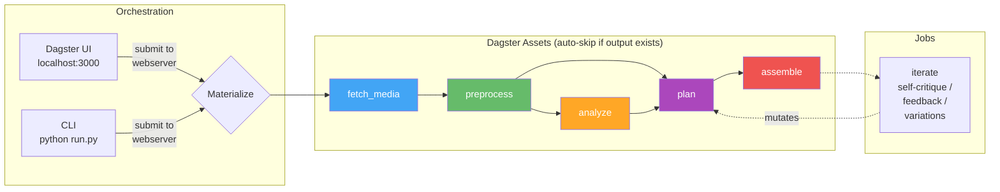
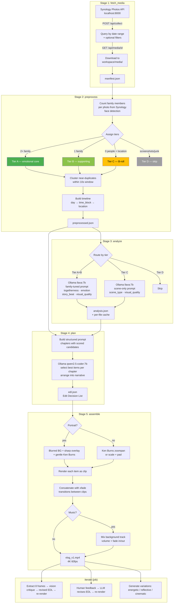

# vlog

Automated vlog generation from Synology Photos. Downloads trip photos, analyzes them with local AI, plans a narrative, and renders a highlight reel — all locally. Orchestrated by [Dagster](https://dagster.io) with a web UI for monitoring, resume, and re-materialization.

## Architecture



## Quick Start

```bash
# Start all services (Ollama, Synology API, Dagster)
./start.sh

# Open Dagster UI
open http://localhost:3000

# Run pipeline from CLI (also visible in UI)
python run.py -n singapore auto -f 2025-06-13 -t 2025-06-17 --style upbeat --duration 180 --item-types 0

# Stop all services
./start.sh stop
```

## Workspace Structure

```
workspace/
  media/                          ← shared: raw photos/videos (downloaded once)
  analysis_cache/                 ← shared: per-file vision results ({item_id}.json)
  keyframes/                      ← shared: extracted video keyframes
  runs/
    singapore/                    ← per-run: isolated pipeline outputs
      manifest.json
      preprocessed.json
      analysis.json               ← assembled from shared cache
      edl.json
      clips/
      output/vlog_v1.mp4
    singapore-cinematic/          ← another run, same source data
      edl.json
      clips/
      output/vlog_v1.mp4
```

Media files and analysis results are shared across runs. A second run for the same trip (or overlapping dates) reuses all downloads and vision results — only plan + assemble re-run.

## Usage

### Web UI (Dagster)

After `./start.sh`, open **http://localhost:3000**.

**Run the full pipeline:** Jobs → full_pipeline → Launchpad → paste config:

```yaml
ops:
  fetch_media:
    config:
      from_date: "2025-06-13"
      to_date: "2025-06-17"
      item_types: [0]
  plan:
    config:
      style: upbeat
      target_duration: 180
      focus: happiness with family
resources:
  io_manager:
    config:
      run_name: singapore
```

**Resume:** Materialize All with defaults — auto-skips stages with existing outputs.

**Force re-run a stage:** Click any asset → Materialize → set `force: true` in config.

**Monitor progress:** Run event log shows per-item status for every stage, with ETA for analyze and assemble.

**View results:** Click any asset → Metadata tab shows tier tables, top-scored photos, segment summaries.

### CLI

All CLI commands submit to the Dagster webserver — runs appear in the UI.

```bash
# Resume from where you stopped (auto-skips completed stages)
python run.py -n singapore resume

# Full pipeline from scratch
python run.py -n singapore auto -f 2025-06-13 -t 2025-06-17 --style upbeat --duration 180 --item-types 0

# Force re-plan with different style (cascades to re-assemble)
python run.py -n singapore plan --style cinematic --duration 120

# Re-assemble only
python run.py -n singapore assemble

# Self-critique loop
python run.py -n singapore iterate --rounds 2

# Human feedback
python run.py -n singapore iterate --feedback "more family shots at the beach"

# Style variations
python run.py -n singapore variations

# Parallel runs (different trips or styles, isolated workspaces)
python run.py -n tokyo auto -f 2025-07-01 -t 2025-07-05 --style cinematic
```

### Stop / Resume

Stop anytime (Ctrl+C in CLI, or Terminate in UI). Resume with:

```bash
python run.py -n singapore resume    # CLI
# or Materialize All in UI           # UI
```

Each stage checks if its output exists and skips. Within analyze, per-file results are cached — even a killed analysis resumes from the last item.

## Pipeline Stages



## Requirements

- **Python 3.11+** with venv
- **FFmpeg** — video processing (`brew install ffmpeg`)
- **Ollama** — local LLM (`brew install ollama`)
  - `ollama pull llava:7b` — vision analysis
  - `ollama pull qwen2.5-coder:7b` — narrative planning
- **Synology Photos API** — the [synology-photos-project](../synology-photos-project) backend running on `:8000`
- **Dagster** — workflow orchestration (installed automatically via `pip install -e .`)

All services start with `./start.sh` (Ollama, Synology API, Dagster).

### 24GB MacBook constraints

| Component | Model | RAM |
|-----------|-------|-----|
| Vision | llava:7b | ~5GB |
| Planning | qwen2.5-coder:7b | ~5GB |
| Whisper | mlx-whisper medium | ~1.5GB |

Only one Ollama model loaded at a time. Fits comfortably in 24GB. Dagster uses `concurrency_key` to prevent Ollama contention between concurrent runs.

## Key design decisions

- **Dagster asset model** — each stage is a Dagster asset that produces a file. Auto-skips when output exists. Re-materialize from the UI to force re-run + downstream cascade.
- **CLI and UI are unified** — CLI submits runs to the Dagster webserver via GraphQL. All runs appear in the UI with full logs, metadata, and progress.
- **Shared media + analysis cache** — raw files and per-file vision results are shared across runs. A second run for the same trip reuses all downloads and analysis. Only plan + assemble re-run.
- **Per-run isolation** — each run gets its own directory (`workspace/runs/{name}/`) for manifest, EDL, clips, and output. Different styles or date ranges don't interfere.
- **Interruptible everything** — all subprocess calls (FFmpeg, sips) use `Popen` with signal forwarding. All Ollama calls use streaming. Dagster's terminate button kills within seconds.
- **EDL is the central artifact** — a JSON file that flows between plan/assemble/iterate. Changing the edit never re-analyzes media.
- **Synology metadata > AI scoring** — person face tags and GPS locations from Synology are more reliable than a 7B vision model's judgment. AI fills in what metadata can't (emotion, composition, scene type).
- **Tiered analysis** — family-together photos (tier A) get a detailed prompt; scene shots (tier C) get a minimal one. Cuts GPU time ~40%.
- **Portrait-aware rendering** — portrait photos/videos get blurred background + sharp foreground overlay instead of black bars or awkward center crops.
- **HEIC via sips** — Apple HEIC photos are converted using macOS `sips` (not FFmpeg, which decodes HEIC grid tiles as 512x512 thumbnails).

## Testing

```bash
source venv/bin/activate
python -m pytest tests/ -v                    # all 107 tests (~2s)
python -m pytest tests/ -m integration -v     # integration tests only (requires FFmpeg)
python -m pytest tests/ -m "not integration"  # unit/mocked tests only
```
