# vlog

Automated vlog generation from Synology Photos. Downloads trip photos, analyzes them with local AI, plans a narrative, and renders a highlight reel — all locally.

## Pipeline

```mermaid
flowchart TD
    subgraph "Stage 1: Fetch"
        F1[Synology Photos API<br/>localhost:8000] -->|POST /api/collect| F2[Query by date range<br/>+ optional filters]
        F2 -->|GET /api/media/id| F3[Download photos/videos<br/>to workspace/raw/]
        F3 --> F4[manifest.json<br/>539 items with metadata]
    end

    subgraph "Stage 2: Preprocess"
        F4 --> P1[Count family members<br/>per photo from Synology<br/>face detection]
        P1 --> P2{Assign tiers}
        P2 -->|"2+ family"| PA[Tier A — emotional core]
        P2 -->|"1 family"| PB[Tier B — supporting]
        P2 -->|"0 people + location"| PC[Tier C — B-roll]
        P2 -->|"screenshots/junk"| PD[Tier D — skip]
        PA & PB & PC --> P3[Cluster near-duplicates<br/>within 10s window]
        P3 --> P4[Build timeline<br/>day → time_block → location]
        P4 --> P5[preprocessed.json<br/>390 unique moments<br/>35 chapters]
    end

    subgraph "Stage 3: Analyze"
        P5 --> A1{Route by tier}
        A1 -->|Tier A+B| A2[Ollama llava:7b<br/>family-tuned prompt<br/>togetherness · emotion<br/>story_beat · visual_quality]
        A1 -->|Tier C| A3[Ollama llava:7b<br/>scene-only prompt<br/>scene_type · visual_quality]
        A1 -->|Tier D| A4[Skip]
        A2 & A3 --> A5[analysis.json<br/>~355 items scored]
    end

    subgraph "Stage 4: Plan"
        P5 & A5 --> PL1[Build structured prompt<br/>chapters with scored candidates]
        PL1 --> PL2[Ollama qwen2.5-coder:7b<br/>select best items per chapter<br/>arrange into narrative]
        PL2 --> PL3[edl.json<br/>Edit Decision List<br/>segments → items → effects]
    end

    subgraph "Stage 5: Assemble"
        PL3 --> AS0{Portrait?}
        AS0 -->|yes| AS0a[Blurred BG + sharp overlay<br/>+ gentle Ken Burns]
        AS0 -->|no| AS0b[Ken Burns zoompan<br/>or scale + pad]
        AS0a & AS0b --> AS1[Render each item as clip]
        AS1 --> AS2[Concatenate with xfade<br/>transitions between clips]
        AS2 --> AS3{Music?}
        AS3 -->|yes| AS4[Mix background track<br/>volume + fade in/out]
        AS3 -->|no| AS5[vlog_v1.mp4]
        AS4 --> AS5
    end

    subgraph "Stage 6: Iterate"
        AS5 --> IT1[Extract 8 frames<br/>from rendered vlog]
        IT1 --> IT2[Send frames + EDL<br/>to vision model for critique]
        IT2 --> IT3[Generate improved EDL]
        IT3 --> IT4[Re-render → vlog_v2.mp4]
        IT4 -.->|repeat| IT1

        AS5 --> IT5[Human feedback<br/>'more family, less food']
        IT5 --> IT6[LLM revises EDL]
        IT6 --> IT7[Re-render]

        AS5 --> IT8[Generate variations<br/>energetic / reflective / cinematic]
    end

    style PA fill:#4CAF50,color:#fff
    style PB fill:#8BC34A,color:#fff
    style PC fill:#FFC107,color:#000
    style PD fill:#9E9E9E,color:#fff
```



## Usage

```bash
source venv/bin/activate

# Full auto pipeline
python run.py auto -f 2025-06-13 -t 2025-06-17 --style upbeat --duration 180

# Or step by step
python run.py fetch -f 2025-06-13 -t 2025-06-17 --item-types 0
python run.py preprocess                          # instant — metadata only
python run.py analyze                             # ~1.5h for 355 items
python run.py plan --style upbeat --duration 180
python run.py assemble
python run.py iterate --feedback "more family shots at the beach"
python run.py variations
```

## Requirements

- **Python 3.11+** with venv
- **FFmpeg** — video processing (`brew install ffmpeg`)
- **Ollama** — local LLM (`brew install ollama`)
  - `ollama pull llava:7b` — vision analysis
  - `ollama pull qwen2.5-coder:7b` — narrative planning
- **Synology Photos API** — the [synology-photos-project](../synology-photos-project) backend running on `:8000`

### 24GB MacBook constraints

| Component | Model | RAM |
|-----------|-------|-----|
| Vision | llava:7b | ~5GB |
| Planning | qwen2.5-coder:7b | ~5GB |
| Whisper | mlx-whisper medium | ~1.5GB |

Only one Ollama model loaded at a time. Fits comfortably in 24GB.

## Key design decisions

- **EDL is the central artifact** — a JSON file that flows between plan/assemble/iterate. Changing the edit never re-analyzes media.
- **Synology metadata > AI scoring** — person face tags and GPS locations from Synology are more reliable than a 7B vision model's judgment. AI fills in what metadata can't (emotion, composition, scene type).
- **Tiered analysis** — family-together photos (tier A) get a detailed prompt; scene shots (tier C) get a minimal one. Cuts GPU time ~40%.
- **Portrait-aware rendering** — portrait photos/videos get blurred background + sharp foreground overlay instead of black bars or awkward center crops.
- **HEIC via sips** — Apple HEIC photos are converted using macOS `sips` (not FFmpeg, which decodes HEIC grid tiles as 512x512 thumbnails).
- **Resumable** — every stage saves incrementally. Kill and restart without losing progress.

## Testing

```bash
source venv/bin/activate
python -m pytest tests/ -v                    # all tests (~2s)
python -m pytest tests/ -m integration -v     # integration tests only (requires FFmpeg)
python -m pytest tests/ -m "not integration"  # unit/mocked tests only
```
