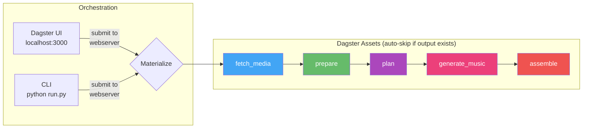

# vlog

Automated vlog generation from Synology Photos. Downloads trip photos/videos, plans a narrative with Gemini (which sees actual photos and listens to video clips), generates background music via Gemini Lyria RealTime, and renders a polished highlight reel. Orchestrated by [Dagster](https://dagster.io) with a web UI.

## Architecture



## Quick Start

### Prerequisites

- **Python 3.11+** — [python.org/downloads](https://www.python.org/downloads/)
- **Git** — for cloning repos
- **Synology NAS** with Photos enabled (for the media source)
- **Gemini API key** — free, get one at [ai.google.dev](https://ai.google.dev/) → "Get API key"

FFmpeg is also needed but `start.py` will offer to install it for you.

### 1. Clone and setup

```bash
git clone <this-repo-url>
cd vlog

# First run: creates venvs, installs all deps, walks you through .env config, starts services
python start.py
```

The setup wizard will prompt you for:
- Synology NAS IP, port, and credentials
- Gemini API key (paste the key from ai.google.dev)
- Other settings with sensible defaults — just press Enter

On first run, `start.py` will:
1. Clone [synology-photos-project](../synology-photos-project) if missing
2. Check for FFmpeg (offers to auto-install via winget/brew/apt)
3. Create Python venvs and install all dependencies (Dagster, google-genai, etc.)
4. Walk you through `.env` configuration (NAS credentials, Gemini API key)

Subsequent runs (`python start.py`) skip setup and just start services:
```
=== Services Ready ===
  Synology Photos API:  http://localhost:8000
  Dagster UI:           http://localhost:3000
```

### 2. Activate the venv

`start.py` installs all dependencies into a local `venv/`, not system Python. **Always activate it before running `run.py`:**

```bash
# Windows
venv\Scripts\activate

# macOS / Linux
source venv/bin/activate
```

Your prompt should now show `(venv)`. All `python run.py` commands below assume the venv is activated.

### 3. Run the pipeline

```bash
# Defaults: Gemini music, 4K 60fps — just add dates and focus
python run.py -n singapore full -f 2025-06-13 -t 2025-06-17 \
  --duration 180 --style cinematic \
  --focus "happiness of family trip; exotic scenes of Singapore"
```

### 4. Monitor in Dagster UI

Open **http://localhost:3000** — the CLI prints a direct link to each run:
```
Run submitted: 94f28746-9f4d-4399-90bf-2da7d485fbf0
View at: http://localhost:3000/runs/94f28746-...
```

### Iteration workflow

Use low-res previews to iterate on narrative/selection quickly, then do a final 4K render:

```bash
# 1. Fast preview (~1min render, ~20MB file) — check if story works
python run.py -n sg-draft full -f 2025-06-13 -t 2025-06-17 \
  --duration 180 --style energetic \
  --width 640 --height 360 --fps 15 --quality 0.3

# 2. Happy with the edit? Re-plan with tweaks if needed
python run.py -n sg-draft plan --style cinematic --duration 120

# 3. Final 4K render (default settings)
python run.py -n sg-final full -f 2025-06-13 -t 2025-06-17 \
  --duration 180 --style energetic

# Stop all services when done
python start.py stop
```

## Workspace Structure

```
workspace/
  ── Shared across all runs (cached, reused) ──
  media/                          <- raw photos/videos from NAS (downloaded once)
  analysis_cache/                 <- per-file prepare results ({item_id}.json)
  thumbnails/                     <- 600px JPEG thumbnails for contact sheets
  contact_sheets/                 <- grid images (6 photos/sheet) sent to Gemini
  preview_clips/                  <- 320p 10fps MP4 clips sent to Gemini
  music/                          <- generated music tracks (Lyria/MusicGen)

  ── Per-run (isolated pipeline outputs) ──
  runs/
    singapore/
      manifest.json               <- fetched items from NAS
      preprocessed.json            <- family names + timeline
      analysis.json                <- per-item metadata (media type, duration, EXIF)
      edl_v1.json, edl_v2.json    <- versioned EDLs from Gemini
      clips/                       <- 4K rendered clips (Phase 1 intermediates)
      output/
        vlog_v1.mp4               <- final rendered vlog
        chapters_v1.txt           <- YouTube chapter markers
        ffmpeg_commands.log       <- all FFmpeg commands for debugging
    singapore-cinematic/           <- another run, same source data
      ...
```

Shared files are reused across runs — a second run for the same trip skips media download, thumbnails, and preview clip generation. Only plan + assemble re-run.

## Usage

### Commands

All CLI commands submit to the Dagster webserver — runs appear in the UI at http://localhost:3000.

| Command | Description |
|---------|-------------|
| `python run.py -n <name> full ...` | Run the full pipeline end-to-end |
| `python run.py -n <name> resume` | Resume — auto-skips completed stages |
| `python run.py -n <name> plan ...` | Re-plan + re-assemble (reuses cached media) |
| `python run.py -n <name> assemble` | Re-render from current EDL |
| `python run.py workspace` | Show disk usage |
| `python run.py workspace --clean all -y` | Delete all workspace data |
| `python start.py stop` | Stop all services |

The `-n` / `--run-name` flag is required for most commands. It isolates each run in its own directory under `workspace/runs/<name>/`.

### Full pipeline flags

```
python run.py -n <name> full [OPTIONS]
```

**Required:**

| Flag | Description |
|------|-------------|
| `-f` / `--from-date` | Start date (`YYYY-MM-DD`) |
| `-t` / `--to-date` | End date (`YYYY-MM-DD`) |

**Content selection:**

| Flag | Default | Values | Description |
|------|---------|--------|-------------|
| `--trip-type` | `family` | `family`, `solo`, `food`, `adventure`, `architecture`, `general` | Controls scoring profile, narrative style, and music mood templates |
| `--item-types` | all | `photo`, `video`, `live`, `motion` (comma-separated) | Media types to fetch from NAS. Omit to include everything |
| `--country` | — | any string | Filter by country (e.g. `Singapore`) |
| `--district` | — | any string | Filter by district/city (e.g. `"Marina Bay"`) |
| `--focus` | derived from trip-type | free text | What to emphasize (e.g. `"family happiness; exotic street food"`) |
| `--lang` | `en` | `en`, `cn`, `both` | Text language for title, overlays, chapters |

**Planning:**

| Flag | Default | Values | Description |
|------|---------|--------|-------------|
| `--style` | `upbeat` | `upbeat`, `cinematic`, `reflective`, `energetic` | Controls pacing, transitions, and music mood |
| `--duration` | `60` | seconds | Target vlog length. 60 = ~1 min, 180 = ~3 min |

**Music:**

| Flag | Default | Values | Description |
|------|---------|--------|-------------|
| `--music` | `auto` | `auto`, `local`, `/path/to/file`, `none` | `auto` = Gemini Lyria RealTime (~8s). `local` = MusicGen (~20 min, no API). Path = custom file. `none` = silent |

**Output:**

| Flag | Default | Values | Description |
|------|---------|--------|-------------|
| `--width` | `3840` | pixels | Output video width |
| `--height` | `2160` | pixels | Output video height |
| `--fps` | `60` | frames/sec | Output frame rate |
| `--quality` | `1.0` | float | Bitrate multiplier. Scales the base bitrate for the given resolution/fps |

Quality presets and resulting bitrates:

| `--quality` | Use case | 4K 60fps | 1080p 30fps | 720p 30fps |
|-------------|----------|----------|-------------|------------|
| `0.5` | Draft / quick share | 33 Mbps | 4 Mbps | 2 Mbps |
| `1.0` | YouTube upload (default) | 67 Mbps | 8 Mbps | 5 Mbps |
| `1.5` | High quality archive | 100 Mbps | 12 Mbps | 7 Mbps |
| `2.0` | Master / editing source | 134 Mbps | 16 Mbps | 10 Mbps |

**Advanced:**

| Flag | Default | Description |
|------|---------|-------------|
| `--family` | auto-detect | Comma-separated family member names (e.g. `"Yi Zhang,Liang Guo,Yuer Guo"`). Default: auto-detected from NAS face recognition data |
| `--force-prepare` | off | Force re-run prepare stage (ignore cached analysis.json) |

### Examples

**Family trip highlight reel:**
```bash
python run.py -n singapore full -f 2025-06-13 -t 2025-06-17 \
  --duration 180 --style cinematic \
  --focus "happiness of family trip; exotic scenes of Singapore"
```

**Quick preview (low res, draft quality):**
```bash
python run.py -n sg-test full -f 2025-06-13 -t 2025-06-16 \
  --duration 60 --width 640 --height 360 --fps 15 --quality 0.5
```

**Solo travel montage:**
```bash
python run.py -n tokyo full -f 2025-03-01 -t 2025-03-05 \
  --trip-type solo --style energetic --duration 120 \
  --focus "street culture, neon lights, temple serenity"
```

**Chinese text overlays:**
```bash
python run.py -n sg-cn full -f 2025-06-13 -t 2025-06-17 \
  --duration 180 --lang cn
```

**Re-plan with different style (keeps cached media):**
```bash
python run.py -n singapore plan --style reflective --duration 120
```

### Web UI (Dagster)

After `python start.py`, open **http://localhost:3000**.

Pipeline graph: `fetch_media -> prepare -> plan -> generate_music -> assemble`

**Run the full pipeline:** Jobs -> full_pipeline -> Launchpad -> paste config.

**Resume:** Materialize All with defaults — auto-skips stages with existing outputs.

**Monitor progress:** Run event log shows per-item status for every stage, with ETA for prepare and assemble.

## Pipeline Stages

### 1. fetch_media
Downloads photos/videos from Synology Photos API, filtered by date range, location, person IDs, and item types.

### 2. prepare
Merged preprocess + analyze into a single stage. Detects family members (from Synology face recognition), builds a day/time_block/location timeline, generates thumbnails and extracts EXIF data. All items are sent forward — Gemini sees them visually via contact sheets and makes its own selection decisions.

### 3. plan
Gemini sees actual photos via contact sheets and listens to video clips (with audio). Single-pass planning with chain-of-thought:
- Design narrative arc (4-6 chapters by story beat)
- See ALL photos/videos, pick items, assign music_mood, set `keep_audio`/`playback_speed`/transitions/color_temp
- Self-review: check pacing, variety, video/photo balance

Prompts are externalized to `pipeline/prompts/` for hot-reloading without code changes.

Fault tolerance: auto-retry on parse failure (1 retry), fuzzy path matching for hallucinated file paths, duration check (warns if <80% of target).

Outputs versioned EDL (`edl_v{N}.json`). Render settings (resolution, fps, quality) stored in EDL. Requires `GEMINI_API_KEY`.

#### What goes in and out of Gemini

**Sent to Gemini (per item):**

| Data | Format | Source | Example |
|------|--------|--------|---------|
| Contact sheet | JPEG grid (6 photos/sheet @ 600px) | Pillow compositing | `contact_sheets/2025-06-13_afternoon_Marina_Bay.jpg` |
| Video clip | MP4 (320p 10fps CRF35, with audio) | FFmpeg extraction | `contact_sheets/clip_87681_0.mp4` |
| People | Text: who's in the photo | NAS face recognition → `family_count` | `#01: family together (Alice,Bob)` |
| Time | Text: when taken | EXIF / NAS metadata | `time=14:30` |
| Location | Text: where taken | NAS metadata / EXIF GPS | `at=Chinatown` |
| Video duration | Text: total length | ffprobe | `video=45s` |
| EXIF (photos) | Text: camera settings | Pillow EXIF extraction | `24mm f/1.4 ISO100` |
| File path | Text: for source_file reference | Local filesystem path | `path=workspace/media/87681_IMG.jpg` |
| Trip context | Text: type, style, family names, duration target | CLI args | `family trip, 180s, Family: Alice, Bob` |
| Trip structure | Text: days and locations summary | Timeline from prepare | `=== Tuesday 2025-06-13 === Marina Bay (12 photos, 3 videos)` |
| System prompt | Markdown: narrative principles, technical rules | `pipeline/prompts/*.md` | Loaded from files, ~7KB |

**Returned by Gemini (EDL):**

| Field | Level | What Gemini decides | Used by |
|-------|-------|-------------------|---------|
| `title` | EDL | Vlog title | Title card rendering |
| `segments[].name` | Segment | Chapter name (narrative, not location) | YouTube chapters, title cards |
| `segments[].narrative_rationale` | Segment | Why these items, what story beat | Logging only |
| `segments[].music_mood` | Segment | Vivid music description | Lyria music generation prompt |
| `segments[].mode` | Segment | `narrative` or `montage` | Transition style in assemble |
| `segments[].color_temp` | Segment | `warm` / `cool` / `neutral` | FFmpeg color grading filter |
| `segments[].transition` | Segment | `crossfade` / `dissolve` / `fade_black` / etc. | FFmpeg xfade filter |
| `segments[].transition_duration` | Segment | Seconds of overlap | Xfade offset calculation |
| `items[].source_file` | Item | Which photo/video to use | File path for rendering |
| `items[].media_type` | Item | `photo` or `video` | Render method selection |
| `items[].display_duration` | Item | How long on screen (3-10s) | Clip length, pacing |
| `items[].start_time` / `end_time` | Item | Video trim points | FFmpeg `-ss` / `-t` |
| `items[].effect` | Item | Ken Burns direction or `none` | Zoompan filter |
| `items[].playback_speed` | Item | `0.5` / `1.0` / `1.5` | FFmpeg setpts/atempo |
| `items[].keep_audio` | Item | Preserve original audio? | Speech track building |
| `items[].text_overlay` | Item | Evocative text + position | FFmpeg drawtext filter |

### 4. generate_music
Generates background music using the EDL's `music_mood` descriptions and `estimated_duration()`. See [Music Generation](#music-generation) for backend options. Saves the music file path back into the EDL. Skipped when `--music none` or a custom file path is provided.

### 5. assemble
Orchestrates 4 phases:

1. **Phase 1**: Parallel clip rendering via `parallel.run_parallel()` — photos get Ken Burns effects, videos trimmed with speed ramps. RenderReport tracks per-clip status.
2. **Phase 2**: Concatenation with segment-level xfade (groups of ≤10 clips for 4K reliability). Speech track built from measured group durations.
3. **Phase 3**: Music + speech mixing with audio ducking. Title cards rendered for intro/outro.
4. **Phase 4**: Output validation — 6 automated checks (file size, duration vs EDL, streams, codec, A/V sync drift, resolution).

All FFmpeg commands logged to `output/ffmpeg_commands.log` and Dagster INFO logs.

## Trip Types & Scoring

Each trip type has a different narrative guidance (editable in `pipeline/prompts/narrative_guidance.json`):

| Trip Type | Focus | Narrative guidance |
|-----------|-------|-------------------|
| family | Family happiness | 30-40% family close-ups, genuine laughter, shared meals |
| solo | Personal journey | Grand landscapes, solitary wonder, quality over people |
| food | Culinary experiences | Close-ups of dishes, market stalls, restaurant ambiance |
| adventure | Action and awe | Dramatic pacing, movement, discovery, nature |
| architecture | Design and space | Buildings, structures, visual quality, striking compositions |
| general | Balanced highlights | Mix people/places/moments, variety and quality |

## Music Generation

The `generate_music` pipeline step creates background music before assembly. Controlled by the `--music` flag:

| `--music` | Backend | Speed | Quality | Setup |
|-----------|---------|-------|---------|-------|
| `auto` (default) | Gemini Lyria RealTime | ~8s for 60s | 48kHz stereo | `GEMINI_API_KEY` (same key used for planning) |
| `local` | MusicGen (facebook/musicgen-medium) | ~20 min for 60s | 32kHz mono | `pip install -e ".[music]"` + ~6GB model |
| `/path/to/file` | Custom file | instant | — | — |
| `none` | No music | — | — | — |

Both backends use the `music_mood` from EDL segments (set by Gemini during planning) as the generation prompt, with fallback templates per trip_type + style. Generated tracks are cached in `workspace/music/`.

## Requirements

- **Python 3.11+** with venv
- **FFmpeg** — video processing
- **Synology Photos API** — the [synology-photos-project](../synology-photos-project) backend running on `:8000`
- **Gemini API key** — for planning and music generation (`GEMINI_API_KEY` in `.env`)

All of the above (venvs, deps, Dagster, services) are handled by `python start.py`. You do not need to pip install manually.

Optional (installed with `pip install -e ".[music]"` inside the venv):
- **PyTorch + transformers + scipy** — local MusicGen music generation (`--music local`)

Other optional extras:
- **pillow-heif** — HEIC/HEIF photo support (`pip install -e ".[heic]"`)

### Platform Notes

| Feature | macOS | Windows | Linux |
|---------|-------|---------|-------|
| HEIC photos | Built-in (sips) | `pip install pillow-heif` | `pip install pillow-heif` |
| FFmpeg | `brew install ffmpeg` | [ffmpeg.org/download](https://ffmpeg.org/download.html) | `apt install ffmpeg` |
| GPU encoding | VideoToolbox (auto) | NVENC (auto-detected) | NVENC (auto-detected) |

### Resource usage

| Component | Model | RAM | Notes |
|-----------|-------|-----|-------|
| Planning | Gemini 3 Flash (remote) | — | Sees actual photos + listens to video clips |
| Music (default) | Lyria RealTime (remote) | — | `--music auto` |
| Music (local) | MusicGen medium | ~6GB | `--music local` |

With defaults, no local AI models are needed — everything runs via Gemini API.

## Testing

```bash
# Activate venv first (Windows: venv\Scripts\activate)
source venv/bin/activate

python -m pytest tests/ -v -m "not integration"  # unit/mocked tests (~1s)
python -m pytest tests/ -v -m integration         # integration tests (requires FFmpeg)
python -m pytest tests/ -v                         # all tests (~25s, 200 tests)
```

## Key design decisions

- **Dagster asset model** — each stage is a Dagster asset that produces a file. Auto-skips when output exists. Re-materialize from the UI to force re-run + downstream cascade.
- **Modular assemble** — split into encoder, filters, render, concat, audio modules. assemble.py is pure orchestration (~300 lines).
- **RenderContext** — per-run state object (quality + caches) replaces scattered module-level globals.
- **FilterGraph** — typed FFmpeg filter chain builder with label validation, replacing raw string concatenation.
- **RenderReport** — structured clip status tracking (ok/skipped/failed with reason) replaces bare print statements.
- **Externalized prompts** — Gemini prompts live in `pipeline/prompts/` as .md/.json files, editable without code changes.
- **Gemini fault tolerance** — auto-retry on parse failure, fuzzy path matching, duration validation.
- **Post-assemble validation** — 6 automated checks catch issues that previously required manual debugging.
- **EDL is self-contained** — render settings (resolution, fps, quality, language) stored in EDL at plan time.
- **Shared parallel runner** — `parallel.run_parallel()` with batching and interrupt handling, used by both plan and assemble.
- **Content-aware rendering** — Ken Burns effects for photos (face-aware crop), portrait mode (blurred background + sharp foreground), speed ramps, varied transitions, subtle color grading with per-segment temperature.
- **YouTube chapter markers** — `chapters_v{N}.txt` output with timestamps for each segment.
- **FFmpeg command logging** — all commands logged at INFO level in Dagster and to `output/ffmpeg_commands.log`.
