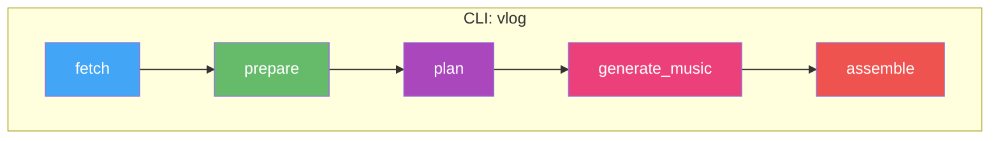

# vlog

Automated vlog generation from photos and videos. Fetches media from a local folder or Synology NAS, plans a narrative with Gemini (which sees actual photos and listens to video audio), generates background music via Gemini Lyria RealTime, and renders a polished highlight reel.

## Architecture



## Quick Start

### Prerequisites

- **Python 3.11+** — [python.org/downloads](https://www.python.org/downloads/)
- **FFmpeg** — video processing (`brew install ffmpeg` / `apt install ffmpeg` / [ffmpeg.org](https://ffmpeg.org/download.html))
- **Gemini API key** — get one at [ai.google.dev](https://ai.google.dev/) → "Get API key"
- **Synology NAS** with Photos enabled (when using `--source nas`)

### 1. Clone and install

```bash
git clone <this-repo-url>
cd vlog
python -m venv venv

# Windows
venv\Scripts\activate
# macOS / Linux
source venv/bin/activate

pip install -e .
```

### 2. Configure

Create a `.env` file with your API key:

```
GEMINI_API_KEY=your-key-here
```

For NAS usage, also add:
```
SYNOLOGY_BASE_URL=http://your-nas-ip:port
SYNOLOGY_USER=your-user
SYNOLOGY_PASS=your-pass
```

### 3. Run the pipeline

```bash
# Full pipeline from local photos
python run.py -n singapore full -s local -p ./photos -r 4k60 \
  --duration 180 --style cinematic \
  --focus "happiness of family trip; exotic scenes of Singapore"

# Full pipeline from NAS
python run.py -n singapore full -s nas -f 2025-06-13 -t 2025-06-17 -r 1080p30 \
  --duration 180 --lang cn
```

### Iteration workflow

Use low-res to iterate quickly, then do a final 4K render:

```bash
# 1. Fast preview (~1min render) — check if story works
python run.py -n sg-draft full -s nas -f 2025-06-13 -t 2025-06-17 -r 720p30 \
  --duration 180 --style energetic --quality 0.3

# 2. Happy with the edit? Re-plan with tweaks
python run.py -n sg-draft plan --style cinematic --duration 120

# 3. Final 4K render
python run.py -n sg-draft assemble -r 4k60
```

## Commands

| Command | Description |
|---------|-------------|
| `python run.py -n <name> full ...` | Full pipeline end-to-end |
| `python run.py -n <name> prepare ...` | Fetch + prepare media only |
| `python run.py -n <name> plan ...` | Re-plan (reuses cached media) |
| `python run.py -n <name> assemble -r <res>` | Re-render from current EDL |
| `python run.py workspace` | Show disk usage |
| `python run.py workspace --clean all -y` | Delete all workspace data |

The `-n` / `--run-name` flag isolates each run in `workspace/runs/<name>/`.

### Full pipeline flags

```
python run.py -n <name> full [OPTIONS]
```

**Source (required):**

| Flag | Description |
|------|-------------|
| `-s` / `--source` | `local` or `nas` |
| `-p` / `--path` | Local folder path (required when `-s local`) |
| `-f` / `--from-date` | NAS start date YYYY-MM-DD (required when `-s nas`) |
| `-t` / `--to-date` | NAS end date YYYY-MM-DD (required when `-s nas`) |

**Resolution (required):**

| Flag | Description |
|------|-------------|
| `-r` / `--resolution` | Preset (`4k60`, `4k30`, `2k60`, `2k30`, `1080p60`, `1080p30`, `720p30`) or custom `WxHxFPS` (e.g. `2560x1440x60`) |

**Content selection:**

| Flag | Default | Values | Description |
|------|---------|--------|-------------|
| `--trip-type` | `family` | `family`, `solo`, `food`, `adventure`, `architecture`, `general` | Narrative style and music mood |
| `--item-types` | all | `photo`, `video`, `live`, `motion` (comma-separated) | Media types to fetch from NAS |
| `--country` | — | any string | NAS filter by country |
| `--district` | — | any string | NAS filter by district/city |
| `--focus` | — | free text | What to emphasize (e.g. `"family happiness; street food"`) |
| `--lang` | `en` | `en`, `cn`, `both` | Text language for title, overlays, chapters |

**Planning:**

| Flag | Default | Values | Description |
|------|---------|--------|-------------|
| `--style` | `upbeat` | `upbeat`, `cinematic`, `reflective`, `energetic` | Pacing, transitions, music mood |
| `--duration` | `60` | seconds | Target vlog length |

**Music:**

| Flag | Default | Values | Description |
|------|---------|--------|-------------|
| `--music` | `auto` | `auto`, `/path/to/file`, `none` | `auto` = Gemini Lyria (~8s). Path = custom file |

**Other:**

| Flag | Description |
|------|-------------|
| `--quality` | Bitrate multiplier: `0.5` = draft, `1.0` = YouTube (default), `2.0` = master |
| `--tz` | UTC offset in hours (e.g. `8` for SGT, `-5` for NYC). Default: system local |
| `--force` | Force re-analyze (ignore cached analysis.json) |
| `--model` | Override Gemini model (default: `gemini-3-flash-preview` or `VLOG_MODEL` env var) |

### Examples

**Family trip, cinematic, Chinese overlays:**
```bash
python run.py -n singapore full -s local -p ./photos -r 4k60 \
  --duration 180 --style cinematic --lang cn \
  --focus "family reunion joy, parents exploring Singapore for the first time"
```

**Solo travel montage from NAS:**
```bash
python run.py -n tokyo full -s nas -f 2025-03-01 -t 2025-03-05 -r 1080p30 \
  --trip-type solo --style energetic --duration 120 \
  --focus "street culture, neon lights, temple serenity"
```

**Re-plan with different style (keeps cached media):**
```bash
python run.py -n singapore plan --style reflective --duration 120
```

## Workspace Structure

```
workspace/
  -- Shared across all runs (cached, reused) --
  media/                          <- raw photos/videos (downloaded once)
  analysis_cache/                 <- per-file prepare results ({item_id}.json)
  thumbnails/                     <- 600px JPEG thumbnails (prepare stage)
  preview_clips/                  <- 360p 1fps MP4 previews sent to Gemini
  music/                          <- generated music tracks (Lyria/MusicGen)

  -- Per-run (isolated pipeline outputs) --
  runs/
    singapore/
      manifest.json               <- fetched items list
      preprocessed.json           <- family names + timeline
      analysis.json               <- per-item metadata (media type, duration, EXIF)
      edl_v1.json, edl_v2.json   <- versioned EDLs from Gemini
      clips/                      <- rendered clips (resolution-tagged, e.g. seg00_item00_1080p30.mp4)
      output/
        vlog_v1_1080p30.mp4      <- final rendered vlog (resolution in filename)
        chapters_v1_1080p30.txt  <- YouTube chapter markers
        ffmpeg_commands.log      <- all FFmpeg commands for debugging
      run_*.log                   <- pipeline log
      run_status.json             <- stage status summary
```

Shared files are reused across runs — a second run for the same trip skips media download, thumbnails, and preview clip generation.

## Media Processing

### Photo pipeline

```
prepare                          plan                             assemble
───────                          ────                             ────────
source photo                     read thumbnail bytes             source photo (original)
(HEIC/JPG/PNG, 3000-4000px)      → send inline to Gemini          → HEIC? convert to JPEG
  │                                                                  (cache: heic_converted/)
  ↓                                                                → FFmpeg: Ken Burns (cosine
PIL open (pillow-heif for HEIC)                                      eased) + color grade +
  → resize to 400px, q70                                             text overlay (drop shadow)
  → save as JPEG                                                   → portrait: blurred bg +
                                                                     sharp fg overlay
cache: thumbnails/{stem}_thumb.jpg                                 cache: clips/seg_item_{res}.mp4
```

### Video pipeline

```
prepare                          plan                             assemble
───────                          ────                             ────────
source video                     read cached previews             source video (original)
(MOV/MP4, 1080p-4K)              → burn #XX labels +              → FFmpeg: trim (start→end)
  │                                concat into mega-preview         + speed ramp (setpts)
  ↓                                (single FFmpeg call)             + color grade + text overlay
ffprobe: duration, resolution,   → upload mega-preview             → portrait: blurred bg
  FPS, orientation                 via Files API                  → output duration =
ffmpeg loudnorm: audio level     → send to Gemini                   source_dur / speed
  (first 30s → silent/quiet/
   normal/loud)                  mega-preview cached across       cache: clips/seg_item_{res}.mp4
  → cache: analysis_cache/       plan re-runs (hash key)
    {id}.json

generate 360p 1fps preview
  (with audio, for Gemini
   to watch + listen)
  → cache: preview_clips/
    preview_{id}.mp4
```

### Cache summary

| Directory | Contents | Created by | Shared across runs |
|-----------|----------|------------|--------------------|
| `workspace/thumbnails/` | 400px JPEG per photo | prepare | yes |
| `workspace/analysis_cache/` | ffprobe + audio level per video | prepare | yes |
| `workspace/preview_clips/` | 360p 1fps preview per video | prepare | yes |
| `workspace/preview_clips/_mega_preview.*` | labeled concatenated preview | plan | yes (cached by hash) |
| `workspace/heic_converted/` | full-size JPEG for HEIC photos | assemble | yes |
| `workspace/runs/{name}/clips/` | rendered clips per resolution | assemble | no (per run) |

## Pipeline Stages

### 1. fetch
Downloads photos/videos from Synology Photos API (filtered by date range, location, item types) or scans a local folder. Builds `manifest.json`.

### 2. prepare
All heavy media processing happens here — plan and assemble only read cached outputs. Generates thumbnails, video metadata, audio levels, and 360p previews. Also: family member auto-detection (NAS face data), timeline construction (day → time_block → location).

### 3. plan
Reads cached thumbnails and previews — no heavy processing. Calls Gemini once.

- Reads photo thumbnail bytes directly (no PIL, no resize)
- Burns #XX labels on video previews + concatenates into one mega-preview (single FFmpeg call, cached across plan re-runs)
- Uploads mega-preview via Files API, sends photo thumbnails inline
- Gemini designs narrative arc, selects items, assigns transitions/speed/audio/text

Fault tolerance: fuzzy path matching, trim point clamping, deduplication, duration validation with optional follow-up call. Outputs versioned `edl_v{N}.json`.

### 4. generate_music
Generates background music from EDL `music_mood` descriptions. Skipped when `--music none`.

| `--music` | Backend | Speed | Quality |
|-----------|---------|-------|---------|
| `auto` (default) | Gemini Lyria RealTime | ~8s for 60s | 48kHz stereo |

### 5. assemble
Renders the final video in 4 phases:

1. **Clip rendering** — parallel (3 NVENC / 2 VideoToolbox / cpu_count/2 libx264 workers). Cached per resolution.
2. **Concatenation** — xfade transitions in groups of ≤10. 8 types: crossfade, dissolve, smoothleft, smoothright, circlecrop, fade_black, wipe_left, fadewhite.
3. **Audio mixing** — music + speech with ducking (300ms attack, 1000ms release). Title cards with hero-photo background.
4. **Validation** — 6 checks: file size, duration, streams, codec, A/V sync, resolution.

Clips cached per resolution — switching from 1080p30 to 4k60 doesn't re-render existing clips. Output: `vlog_v{N}_{res}.mp4`.

## Trip Types

Narrative guidance per trip type (editable in `pipeline/prompts/narrative_guidance.json`):

| Trip Type | Focus |
|-----------|-------|
| family | Family close-ups, genuine laughter, shared meals |
| solo | Grand landscapes, solitary wonder, personal journey |
| food | Dish close-ups, market stalls, restaurant ambiance |
| adventure | Dramatic pacing, movement, discovery, nature |
| architecture | Buildings, structures, striking compositions |
| general | Balanced mix of people, places, moments |

## Requirements

- **Python 3.11+** with venv
- **FFmpeg** — video processing (auto-detected: HEVC on GPU, H.264 on CPU)
- **Gemini API key** — `GEMINI_API_KEY` in `.env`
- **Synology Photos API** — only for `--source nas` (the [synology-photos-project](../synology-photos-project) backend)

No local AI models needed — everything runs via Gemini API.

### Platform Notes

| Feature | macOS | Windows | Linux |
|---------|-------|---------|-------|
| HEIC photos | Built-in | pillow-heif (bundled) | pillow-heif (bundled) |
| GPU encoding | VideoToolbox (auto) | NVENC (auto) | NVENC (auto) |
| CPU fallback | libx264 | libx264 | libx264 |

### Resource usage

| Component | Model | RAM | Notes |
|-----------|-------|-----|-------|
| Planning | Gemini 3 Flash (remote) | — | Sees photos + listens to videos |
| Music | Lyria RealTime (remote) | — | `--music auto` |

## Testing

```bash
source venv/bin/activate  # Windows: venv\Scripts\activate

python -m pytest tests/ -m "not integration"    # unit tests (~2s, 232 tests)
python -m pytest tests/ -m integration           # integration tests (requires FFmpeg)
python -m pytest tests/                           # all tests (255 tests)
```

## How it evolved

This project went through 350+ commits of architectural pivots before arriving at the current design. The history is a story of **removing complexity**.

**v1: Local AI stack** — Started with Ollama (llava for vision, llama3 for text), Whisper for speech detection, OpenCV for face detection, HSV histograms for deduplication, and a scoring-based "tier" system to rank photos. The AI read text descriptions of media, never seeing the actual images. Planning was multi-pass: algorithmic pre-selection → LLM refinement → human feedback loop. Music via local MusicGen model.

**v2: Orchestration era** — Added Prefect for workflow management. Replaced Prefect with Dagster (asset-based model fit better). Built elaborate UI integration: real-time progress, per-asset metadata, structured logs. CLI submitted runs to Dagster webserver. `start.sh` launched 3 services (Ollama, Synology API, Dagster). The system worked but required too many moving parts.

**v3: Gemini pivot** — Switched to Gemini Flash for planning. First with contact sheets (grid images) and filmstrip clips. Then the key realization: **send actual photos and full video previews with audio**. Gemini's visual and aural judgment was better than all the local processing combined.

**v4: The great removal** — Removed Ollama, Whisper, OpenCV, MusicGen, face detection, scene classification, motion analysis, speech detection, visual deduplication, tier scoring, multi-pass planning, the feedback loop, Dagster, and the service launcher. Each removal made the output *better*, not worse — Gemini seeing the actual media made all that preprocessing unnecessary.

**v5: Current design** — Single Python process, 5 stages, one Gemini API call for planning. The codebase is smaller than v2 despite producing better results. The remaining complexity is in FFmpeg rendering (Ken Burns, transitions, audio mixing), which is irreducibly necessary.

The lesson: **the best architecture was the one with the fewest components**. Every local AI model we removed was a model that was worse than Gemini at the same task, adding latency and bugs for negative value.

## Key design decisions

- **Let AI see, not read** — Gemini receives actual photos and watches video previews with audio. It selects items by visual and aural judgment, not by parsing metadata tags. This is the core bet: a model that "sees" like a human editor makes better vlogs than any amount of smart metadata filtering.
- **AI decides the story, code executes it** — Gemini controls all creative decisions (narrative arc, selection, pacing, transitions, text, music mood). FFmpeg only executes the spec. The boundary is the EDL: a JSON file that captures every creative choice and can be re-rendered without re-calling Gemini.
- **Prepare once, iterate fast** — heavy media processing (thumbnails, video probes, previews) runs once. After that, changing style/focus/duration is a single Gemini API call — no FFmpeg, no file I/O, seconds not minutes.
