# ReelSmith Pipeline Architecture

End-to-end data flow: raw media → cached artifacts → EDL → rendered output.

---

## High-Level Pipeline

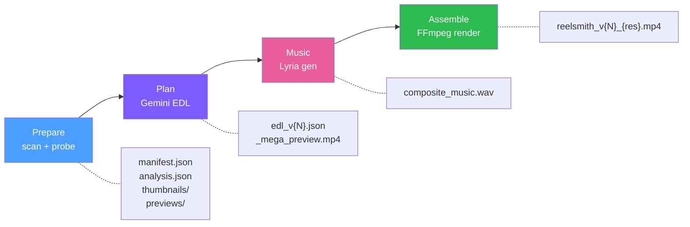

---

## Workspace Layout

```
workspace/
├── thumbnails/                          # SHARED — cached across all runs
│   └── {stem}_{path_hash}_thumb.jpg     #   400px JPEG, keyed by source path
│
├── previews/                            # SHARED — cached across all runs
│   ├── preview_{md5[:12]}.mp4           #   480p 1fps video preview (with audio)
│   ├── _mega_preview.mp4                #   all previews concatenated + #XX labels
│   └── _mega_preview.json               #   offset table (item# → duration, abs timestamp)
│
├── music/                               # SHARED — cached across all runs
│   ├── gemini_{type}_{style}_{dur}s_{hash}.wav   # per-segment Lyria music
│   └── gemini_{type}_{style}_{dur}s_{hash}.json  # generation metadata
│
└── runs/
    └── {run_name}/                      # PER-RUN — isolated workspace
        ├── manifest.json                #   source file listing (scan output)
        ├── analysis.json                #   enriched metadata (prepare output)
        ├── edl_v1.json                  #   EDL version 1 (plan output)
        ├── edl_v2.json                  #   EDL version 2 (re-plan)
        ├── run_{timestamp}.log          #   full pipeline log
        ├── run_config_*.yaml            #   saved CLI parameters
        ├── render/                      #   intermediate clips
        │   ├── seg_0_{res}.mp4          #     per-segment rendered video
        │   ├── intro_title_{res}.mp4    #     title card
        │   └── outro_title_{res}.mp4    #     outro card
        └── output/                      #   final deliverables
            ├── reelsmith_v{N}_{res}.mp4 #     final output video
            └── chapters_v{N}_{res}.txt  #     YouTube chapter markers
```

**Cache key strategy:**

| Cache | Key | Example |
|-------|-----|---------|
| Thumbnails | original stem + path hash | `IMG_0123_a1b2c3d4e5f6_thumb.jpg` |
| Previews | `md5(local_path)[:12]` | `preview_a1b2c3d4e5f6.mp4` |
| Music | mood + generation params hash | `gemini_family_upbeat_180s_f7e8d9.wav` |
| Render clips | segment index + resolution | `seg_0_1080p30.mp4` |

---

## Stage 1: Prepare

Scan source media → extract metadata → generate thumbnails & preview clips.

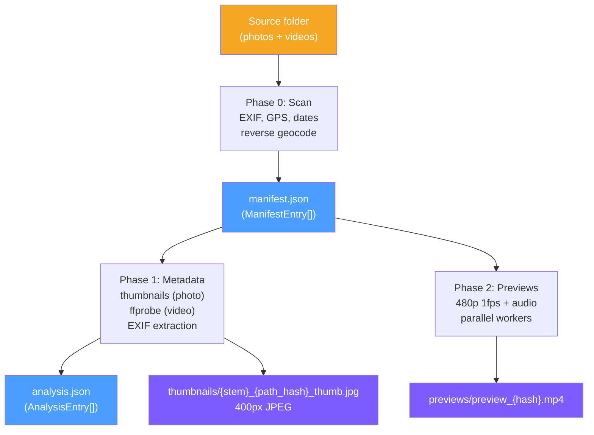

**Data contracts produced:**

| Artifact | Schema | Consumers |
|----------|--------|-----------|
| `manifest.json` | `ManifestEntry[]` — `{taken_at, local_path, filesize?, city?, country?}` | prepare (internal) |
| `analysis.json` | `AnalysisEntry[]` — manifest + thumbnail_path, exif, video_* | plan stage |
| `thumbnails/{stem}_{path_hash}_thumb.jpg` | 400px JPEG | plan (inline to Gemini via `thumbnail_path`) |
| `previews/preview_{hash}.mp4` | 480p 1fps, mono 64kbps AAC | plan (mega-preview) |

---

## Stage 2: Plan

Build visual content → call Gemini → postprocess into validated EDL.

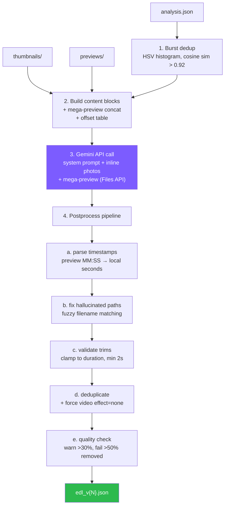

**Gemini input assembly:**

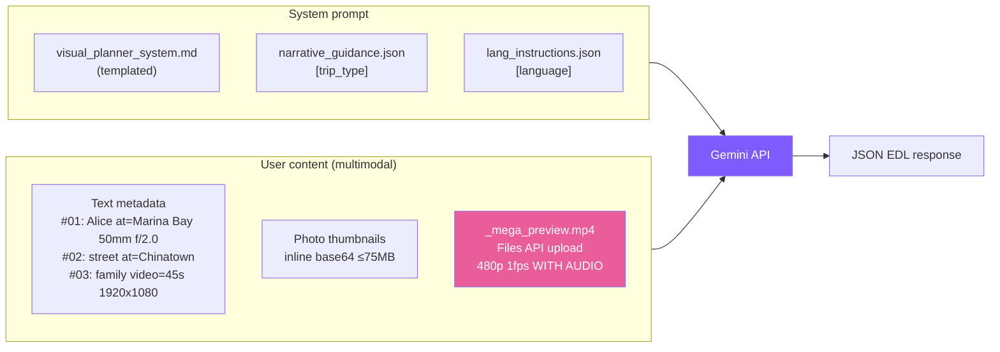

**Key timestamp conversion:**

preview_start/preview_end (MM:SS in mega-preview, Gemini output)
→ offset table lookup →
start_time/end_time (seconds in original source video)

---

## Stage 3: Music

Generate per-segment music from EDL mood descriptions, composite into single track.

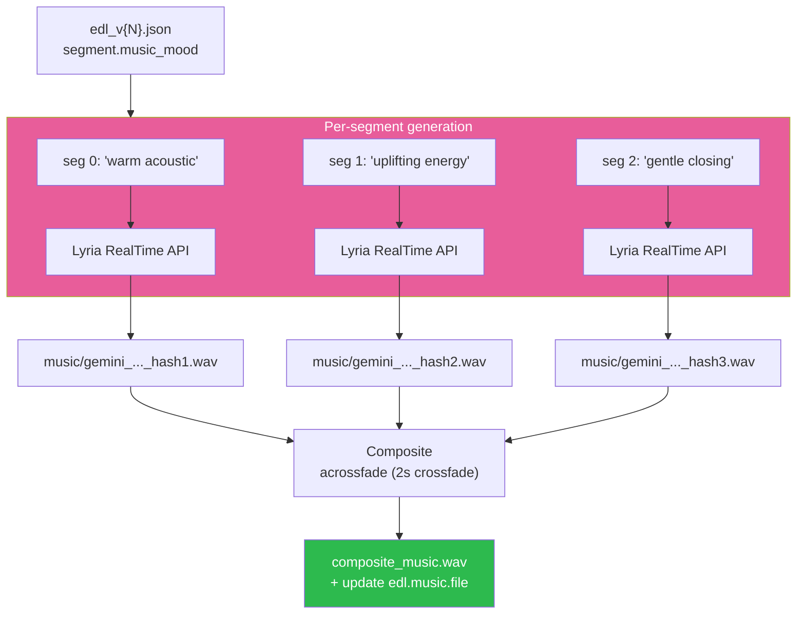

Skipped if `music_mode="none"` or `--music /path/to/track.mp3` (user-provided).

---

## Stage 4: Assemble

Render per-segment clips → concatenate → mix music → validate.

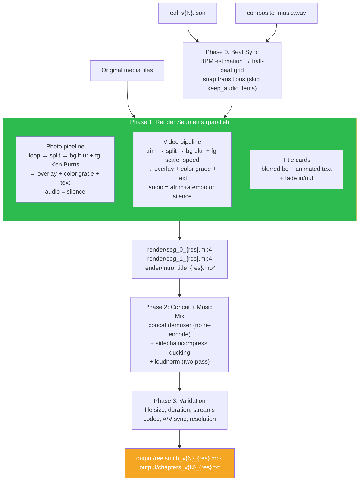

**Encoding chain (auto-detection):**

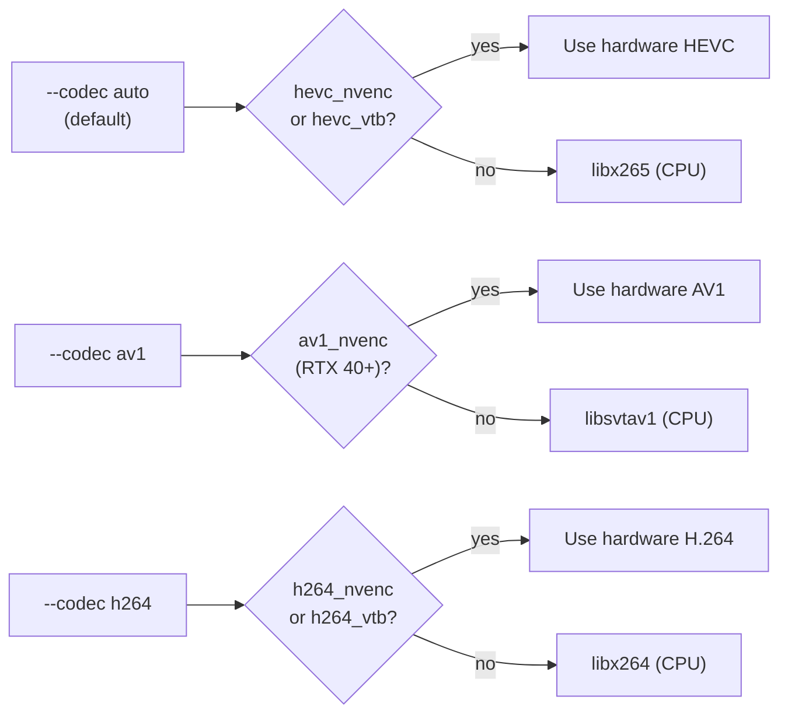

**Bitrate calculation:** `base_rate[resolution] × codec_ratio × fps_multiplier × --quality`

| Resolution | H.264 base | HEVC (×0.65) | AV1 (×0.45) |
|------------|-----------|-------------|-------------|
| 4K | 45 Mbps | 29 Mbps | 20 Mbps |
| 2K | 16 Mbps | 10 Mbps | 7 Mbps |
| 1080p | 8 Mbps | 5 Mbps | 4 Mbps |
| 720p | 5 Mbps | 3 Mbps | 2 Mbps |

fps > 30 → ×1.5 bump

---

## Cross-Stage Data Flow

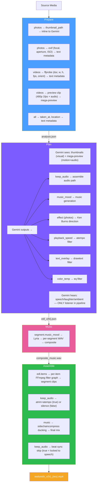

---

## EDL: The Central Data Contract

The EDL (Edit Decision List) is the single artifact that bridges planning and rendering.

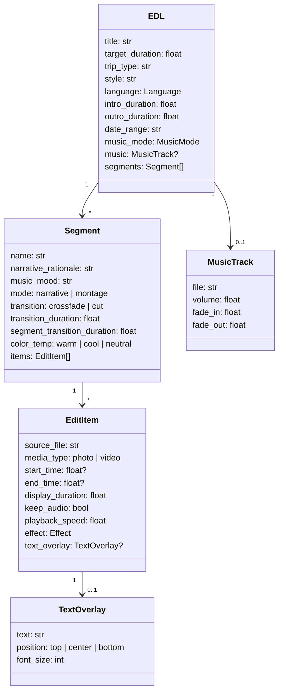

---

## Audio Path Decision Tree

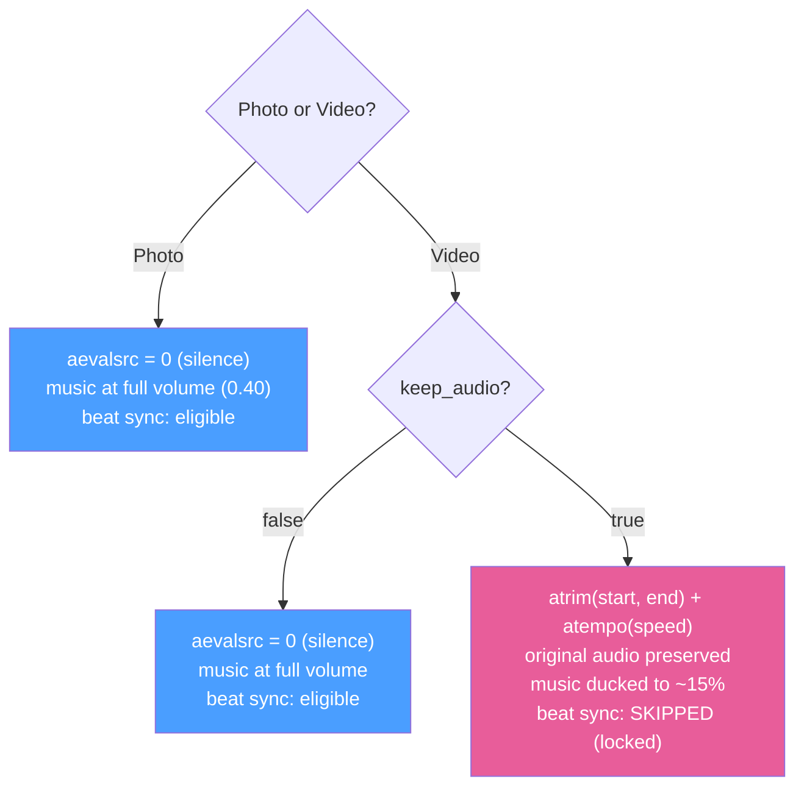

---

## Caching & Resumability

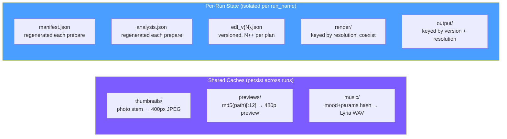

**Re-run behavior:**

| Command | Reuses | Regenerates |
|---------|--------|-------------|
| `reelsmith full` | cached thumbnails + previews | manifest, analysis, EDL, render, output |
| `reelsmith plan` | all prepare artifacts | new EDL version |
| `reelsmith assemble` | EDL + clips at same resolution | output |
| `--force` | nothing | full regeneration |
